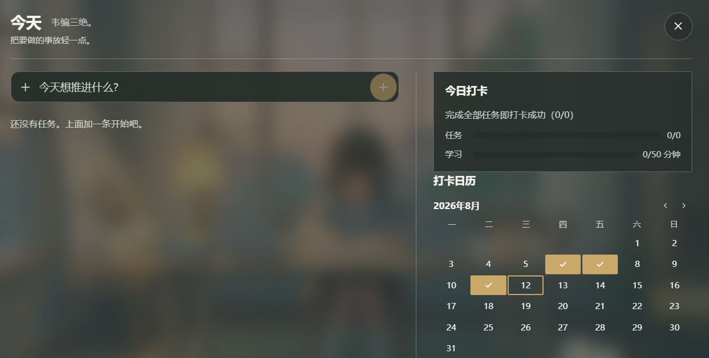
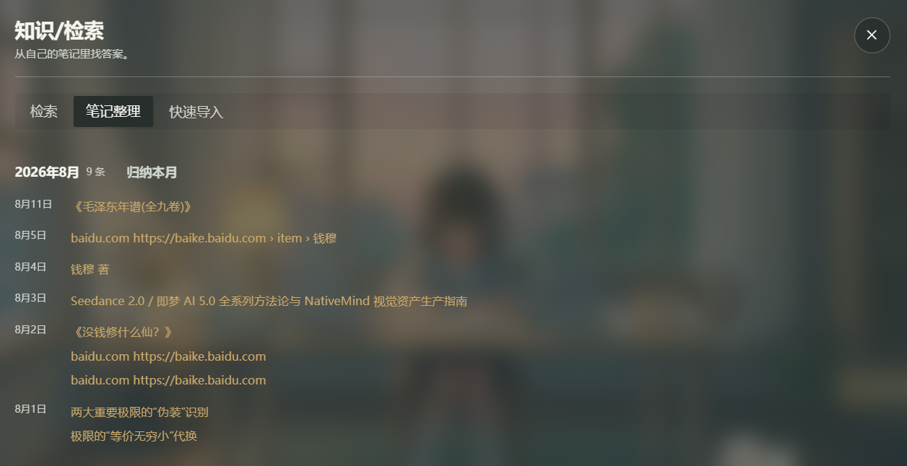
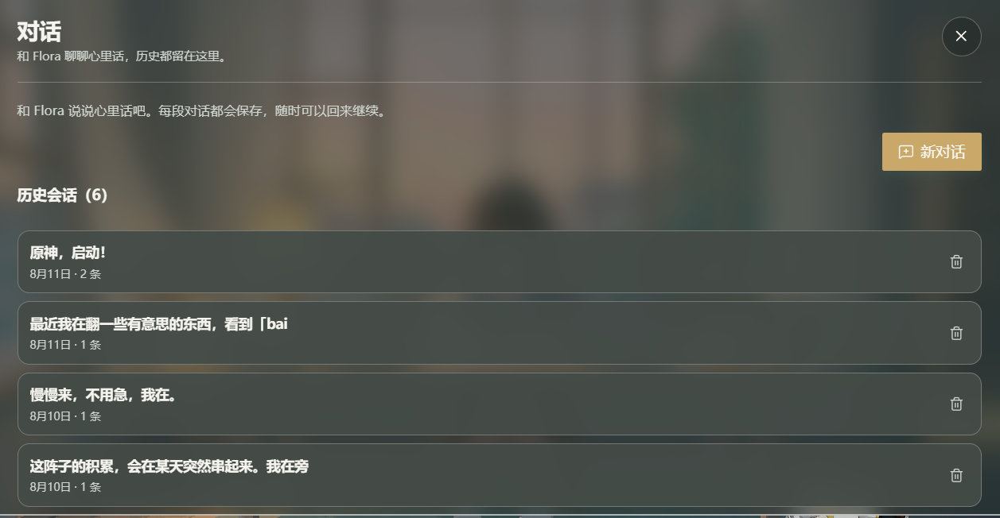
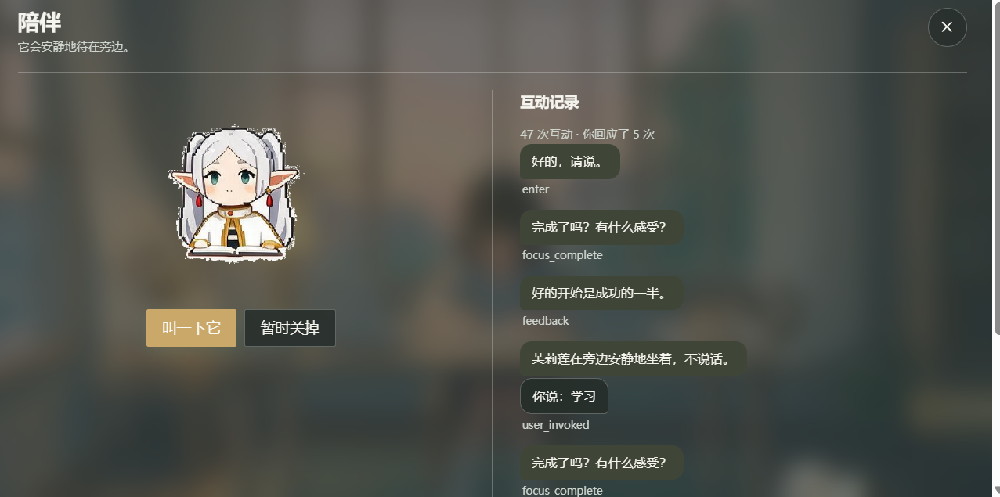
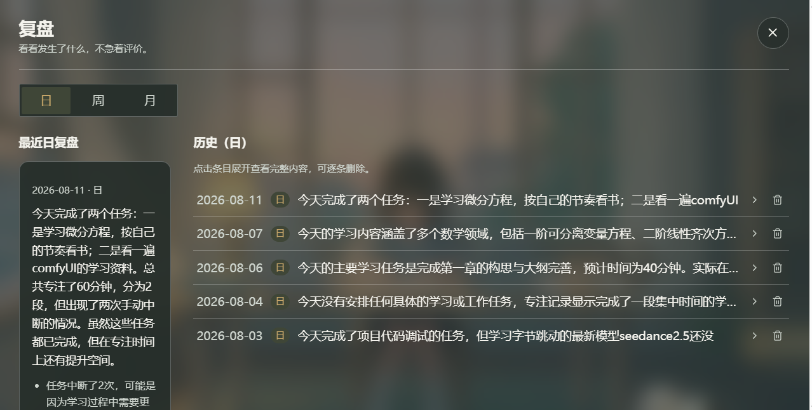

# NativeMind

一个**本地优先**的 AI 学习节律工具 —— 把任务、专注、笔记、知识关联与复盘放在一起，所有数据留在你的本机。

> 核心不是「和 AI 聊天」，而是四件事：
> 1. 把今天要学的东西变清楚
> 2. 把专注过程记录下来
> 3. 把新旧知识自动关联
> 4. 把学习结果沉淀成本地笔记和复盘

## 为什么是「本地优先」

- **数据是你的资产**：笔记、任务、专注记录、复盘全部存在本地 SQLite，默认不联网
- **AI 双引擎**：本地 Ollama 模型 + 可选 DeepSeek 云端（配置 API key 后教练档走云端，本地不可用时自动兜底）
- **AI 是助手不是聊天机器人**：所有 AI 建议都是「草稿」，必须你确认才会写入
- **离线可用**：模型没装、向量库不可用、断网——核心功能照常工作，只是 AI 增强降级

## 功能一览

| 模块 | 功能 |
|---|---|
| 📅 **今天** | Todo 管理 + AI 目标拆解（一条目标自动拆成可执行子任务） |
| 🍅 **专注** | 番茄钟 + 场景环境音 + 本地音乐，可关联任务 |
| 📚 **知识** | 笔记导入（PDF/EPUB/MD/TXT/粘贴/外部搜索）+ 本地 RAG 检索 + 标签管理 |
| 🔗 **知识图谱** | 笔记间关系可视化（SVG 图 + 关系筛选），节点详情可删除/重建链接、手动连接 |
| 📝 **复盘** | 日/周/月 AI 复盘；启动时自动补生成缺失的复盘（昨天/上周/上月） |
| 💬 **提问** | 苏格拉底式引导对话（基于你的笔记） |
| 🐱 **陪伴** | 一只会关心你的桌面小宠物（本地模型对话） |
| 💌 **写信** | 与 Flora 的书信往来 |
| 💾 **数据备份** | 一键导出/恢复完整数据（数据库 + 导入文件 + 配置），换电脑迁移用 |
| ⚙️ **设置** | 模型（本地/DeepSeek）、路径、外部搜索、隐私全部本地持久化 |

## 截图

| | |
|---|---|
| 今日（学习计划与节律） | 主场景（心流小筑） |
|  |  |
| 知识检索（本地 RAG） | 专注模式 |
|  |  |
| 陪伴角色 | 写信对话 |
|  |  |

## 技术栈

- **外壳**：[Tauri v2](https://tauri.app/)（Rust 后端 + 轻量 WebView）
- **前端**：React 19 + TypeScript + Vite + Zustand
- **UI**：自定义毛玻璃 / 温馨手账风格
- **数据库**：SQLite（WAL 模式 + 每日自动备份 7 份轮转）
- **向量检索**：[sqlite-vec](https://github.com/asg017/sqlite-vec)（本地向量检索，无需外部服务）
- **本地模型**：Ollama（快档 1.5B + 教练 14B 双档路由）
- **云端模型（可选）**：DeepSeek API（`deepseek-v4-flash` / `deepseek-v4-pro`，含思考模式）
- **外部搜索**：Bing（默认，无 key）/ Google Custom Search API（需 key，稳定无反爬）
- **代码结构**：Clean Architecture / Hexagonal（domain → application → infrastructure/ai → ui 严格分层）

## 快速开始

```bash
# 1. 安装依赖
npm install

# 2. 桌面开发模式（推荐）
npm run tauri dev

# 或纯浏览器预览（内存驱动，数据不持久化，仅开发调试用）
npm run dev
```

### 前置：本地模型（可选但推荐）

1. 安装 [Ollama](https://ollama.com/download)
2. 拉取模型（设置页也可改模型名）：
   ```bash
   ollama pull qwen2.5:1.5b   # 快档：陪伴对话/意图/关键词
   ollama pull qwen2.5:14b    # 教练档：任务拆分/复盘/知识关联
   ollama pull nomic-embed-text  # 向量检索 embedding
   ```
3. 不装 Ollama 也能打开 App，AI 功能会降级为模板；装好后在 设置 → 模型 检查可用性。

### 可选：DeepSeek 云端（更强的教练档）

设置 → 模型 → 教练模型 (DeepSeek)：填入 API key → 测试 → 保存并启用。
教练任务（任务拆解/复盘/知识关联/深度问答）走云端；本地小模型不可用时 fast 任务自动兜底 DeepSeek。

### 数据位置（Windows）

`%APPDATA%\com.nativemind.app\` —— `nativemind.db` 数据库、`imports/` 导入副本、`backups/` 每日备份。

## 从 Release 获取完整版

- **安装包**：到 [GitHub Releases](../../releases) 下载 NSIS 安装包（应用本体，约 59MB，不含背景音乐）
- **背景音乐**：`background-music.zip`（约 1.2GB，版权素材不入库，作为独立 Release 资产）

### 如何配置背景音乐

安装包为了保持体积（<2GB，NSIS 打包限制）**不内嵌背景音乐**。应用首次启动时会自动在
**资源目录**下创建 `audio/backgrounds/`（场景环境音）和 `audio/songs/`（音乐库兜底）
目录骨架，你只需把音乐放进去。两种方式启用：

**方式一：解压到资源目录（推荐，覆盖所有场景）**
1. 下载 `background-music.zip` 并解压
2. 把解压出的 `audio/backgrounds/` 文件夹放到应用的**资源目录**下，即
   `资源目录/audio/backgrounds/*.mp3`
3. 重启应用，场景环境音 / 专注音乐即生效

**资源目录在哪？** 打开应用 → 设置 → 路径 → 资源目录，输入框里显示的就是当前路径
（Windows 默认在安装目录下；也可手动改成任意目录并保存）。启动后该目录下应已自动存在
`audio/backgrounds` 子目录 —— 没有就手动新建一个即可。

**方式二：逐个场景配置自定义音频**
1. 设置 → 路径 → 为每个场景（天气 × 时段）配置一首本地音频文件
2. 无需下载音乐包，适合只想用几首的情况

**开发版**（`npm run desktop`）：把 `background-music.zip` 解压到 `src-tauri/resources/audio/`，
构建/运行时随 bundle 资源加载。

> 不配置背景音乐不影响任何功能：应用正常运行，只是没有环境音效。

## 换电脑迁移

1. 旧电脑：设置 → 数据备份与恢复 → **导出数据** → 选位置（如 U 盘），生成 `nativemind-backup-时间戳/` 目录
2. 新电脑：设置 → 数据备份与恢复 → **恢复数据** → 选备份目录 → 重启
（恢复前自动备份当前状态，可回退）

## 文档导航

- [使用与实现文档](docs/使用文档.md) — 功能用法 + 各功能实现流程
- [功能总览](docs/功能总览.md) — 按功能逐一说明 UI → 实现
- [ARCHITECTURE.md](ARCHITECTURE.md) — 系统架构总览（分层/端口/事件）
- [AGENTS.md](AGENTS.md) — AI Agent 开发规范
- [docs/DATABASE_SCHEMA.md](docs/DATABASE_SCHEMA.md) — 数据库设计
- [docs/EVENT_SYSTEM.md](docs/EVENT_SYSTEM.md) — 事件系统
- [docs/SECURITY.md](docs/SECURITY.md) — 安全与隐私
- [docs/PLANS.md](docs/PLANS.md) — 开发路线图

## 开发

```bash
npm run dev        # 浏览器演示（内存驱动）
npm run desktop    # Tauri 桌面模式（前端热更新 + 后端重编译）
npm test           # 单元 + 集成测试（vitest，无需 Tauri/Ollama）
npm run typecheck  # TypeScript 严格检查
npm run lint       # ESLint
```

## 设计原则

- **AI 只在用户需要整理、连接、复盘时出现；专注时尽量安静**
- 所有写入型动作必须经过用户确认（AI 建议只是草稿）
- 本地资料优先，外部搜索只作为补充（默认关闭，需显式开启）
- RAG 不是问答机器，而是学习连接器
- 结构化数据是长期资产，模型输出只是草稿

## License

[MIT](LICENSE)
