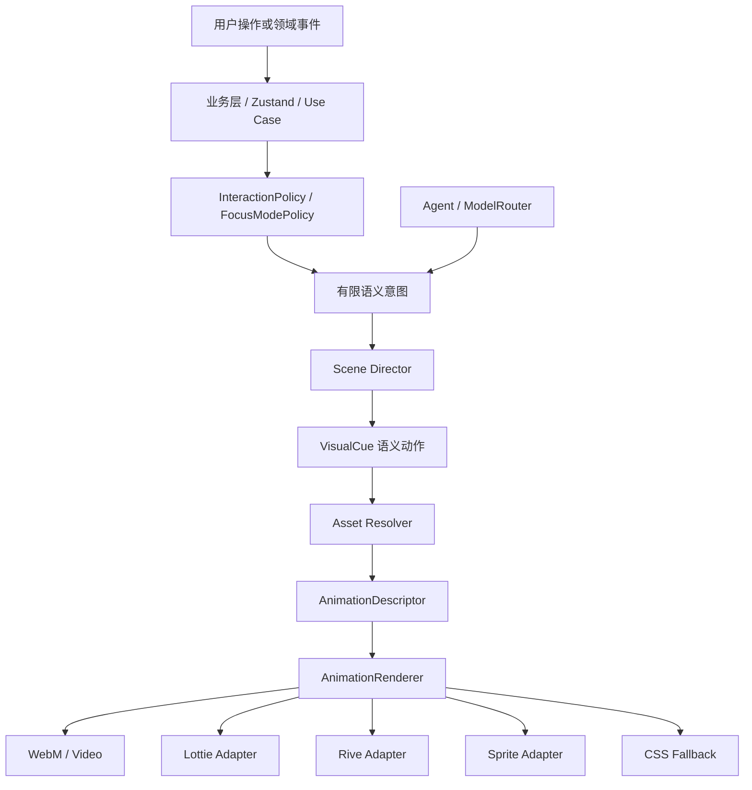

# NativeMind「心流小筑」全屏 UI 重设计、可替换动画资产与六组场景生产规范 V5

> 文档用途：作为 NativeMind 后续 UI 重设计、AI 图片/视频资产生成、动画接入和 Agent 场景联动的统一设计合同。
>
> 目标平台：Windows 桌面端 Tauri 应用。暂不设计手机端、平板端和响应式移动布局。
>
> 当前范围：本文件只做项目分析、视觉重设计提示词、资产规划和后续实现方案，不修改现有业务逻辑，不要求现在接入正式图片或视频资产。
>
> 关联历史文档：
> - `docs/archive/COZY_HOME_FULLSCREEN_AI_ASSET_PROMPT_V4.md`
> - `docs/archive/SEEDANCE2_AI_VIDEO_WORKFLOW_GUIDE.md`
> - `.claude/skills/nativemind-ambient-scene/SKILL.md`
> - `.claude/skills/nativemind-companion-widget/SKILL.md`
> - `.claude/skills/nativemind-pomodoro-flow-ui/SKILL.md`
> - `.claude/skills/nativemind-cozy-ui/SKILL.md`

---

## 0. 使用方式

本文件分为四种用途：

1. **交给 UI 编码 Agent**：使用第 4 至第 7、13 至第 15、17 至第 19 章，约束页面布局、交互、资源接口和实现边界。
2. **交给图像生成模型**：使用第 3、8 至第 12 章，生成静态背景、时间天气变体和角色设定图。
3. **交给视频生成模型或 Seedance 工作流**：使用第 11、12、15、16 章，生成角色循环、天气循环和状态转换动画。
4. **交给后续维护者**：使用第 7、14 至第 20 章，理解资源命名、Manifest、Agent、Scene Director、接入顺序和验收流程。

不要把全文一次性无差别地交给图像模型。正确方式是：

```text
先冻结 Style DNA
  -> 再冻结空间布局
  -> 再生成白天晴天空景
  -> 再生成黄昏/夜晚变体
  -> 再生成雨雪独立图层
  -> 再生成女孩和宠物角色包
  -> 最后生成 Enter / Loop / Exit 动画
```

每次生成只改变一类变量。不要在同一次生成中同时改变房间、天气、时间、角色服装、动作、镜头和画风。

---

## 1. 当前项目 UI 与架构现状

### 1.1 当前首页不是纯 Demo

当前入口文件是：

`src/ui/demo/fullscreen-cozy-home/FullscreenCozyHome.tsx`

该页面已经接入真实运行时，包含：

| 当前能力 | 当前关系 | 设计结论 |
| --- | --- | --- |
| 今天 / Todo | `useTodoStore`、任务刷新、任务操作 | UI 可重新设计，任务状态不能被视觉资产替代 |
| 专注 / 番茄钟 | `useFocusStore`、`useFocusMode`、真实会话状态 | 倒计时、进度和完成/中断必须由代码控制 |
| 知识 / 笔记检索 | `useNoteStore`、导入与搜索能力 | 搜索框、笔记结果、导入状态属于业务 UI |
| 复盘 | `useReviewStore` | 日/周/月切换和统计不能烘焙进图片 |
| 陪伴 | `useCompanionStore`、事件总线、互动记录 | 宠物本体可以换资产，语义状态和气泡由代码驱动 |
| 设置 | 场景、天气、时间预览、亮度、动画、宠物、音乐、模型等 | 设置控件保留代码实现，视觉可分主题 |
| 音频 | `audioPlayer`、音乐 store、背景音和专注音乐 | 播放状态、音量、静音、曲目列表必须保留为业务状态 |
| Tauri 通知 | Tauri plugin notification | 不要放进场景资源或 Agent 自由控制 |
| 数据库 / 运行时 | `startRuntime`、repositories、事件总线 | UI 重设计不能删除或绕过启动流程 |

因此，后续工作不是重新建立一个脱离项目的静态网页，而是：

```text
真实学习工具
  + 全屏环境场景
  + 可替换角色动画
  + 可替换天气与背景资产
  + 低打扰的桌面 HUD
```

### 1.2 当前真实组件树

```text
FullscreenCozyHome
├── SceneViewport
│   ├── SceneBackground
│   │   ├── 书房 / 图书馆 CSS fallback
│   │   ├── 窗户、天空、山丘、飞鸟、星星
│   │   └── 桌面、书、台灯、杯子、盆栽、书架
│   ├── TimeLightingLayer
│   ├── WeatherRenderer
│   │   ├── back：窗外远景雨雪
│   │   └── glass：玻璃水滴或近景雪花
│   ├── GirlActor
│   ├── PetActor
│   ├── WindowMaskedLayer
│   └── vignette
├── TopHud
│   ├── 品牌 / 场景名称
│   ├── 日期 / 当前时间
│   ├── 场景切换
│   ├── 天气切换
│   └── 音量与静音
├── FocusHud
│   ├── 倒计时环
│   ├── 当前任务
│   ├── 开始 / 完成 / 放弃
│   └── 今日专注分钟数
├── FeatureDock
│   └── 今天 / 专注 / 知识 / 复盘 / 陪伴 / 设置
├── LofiHud
│   ├── 播放 / 暂停
│   ├── 上一首 / 下一首
│   ├── 音乐列表
│   └── 均衡器
├── SpeechBubble
├── DemoSheet
│   ├── TodayPanel
│   ├── FocusPanel
│   ├── KnowledgePanel
│   ├── ReviewPanel
│   ├── CompanionPanel
│   └── SettingsPanel
├── Modal / ConfirmationModal / SimpleConfirmModal
├── ToastHost
└── FullscreenFocus
```

### 1.3 当前场景是如何实现的

当前主要文件：

- `src/ui/demo/fullscreen-cozy-home/components/SceneViewport.tsx`
- `src/ui/demo/fullscreen-cozy-home/components/SceneBackground.tsx`
- `src/ui/demo/fullscreen-cozy-home/components/WeatherRenderer.tsx`
- `src/ui/demo/fullscreen-cozy-home/components/GirlActor.tsx`
- `src/ui/demo/fullscreen-cozy-home/components/PetActor.tsx`
- `src/ui/demo/fullscreen-cozy-home/components/AnimationRenderer.tsx`
- `src/ui/demo/fullscreen-cozy-home/scene-manifest.ts`
- `src/ui/demo/fullscreen-cozy-home/scene-director.ts`
- `src/ui/demo/fullscreen-cozy-home/asset-resolver.ts`

当前实现已经具备正确的分层思路：

```text
背景
  -> 时间光照
  -> 窗外天气后层
  -> 女孩
  -> 家具前景
  -> 宠物
  -> 玻璃天气近层
  -> 可读性压暗
  -> HUD 和面板
```

当前视觉内容仍主要由 CSS fallback 构成：

- `SceneBackground.tsx` 使用 CSS 元素组成墙面、书架、窗户、天空、山丘、飞鸟和桌面小物。
- `GirlActor.tsx` 使用 CSS 形状组成女孩剪影、椅子、头发、身体、手臂、笔记本和铅笔。
- `PetActor.tsx` 使用 CSS 形状组成圆润绿色宠物、眼睛、腮红、芽叶和阴影。
- `WeatherRenderer.tsx` 使用 CSS 雨丝、水滴和雪花占位。
- `fullscreen-cozy-home.css` 包含呼吸、眨眼、写字、伸懒腰、睡觉、唤醒和均衡器动画。

这套 fallback 的价值是：没有正式美术资源时页面也能运行，后续资源接入不会改变业务流程。它的局限是：几何形状、颜色和笔触仍然偏“功能占位”，不能作为最终的高品质视觉基准。

### 1.4 当前资源接口的真实状态

`types.ts` 已经预留：

```ts
type AnimationRenderer = 'css' | 'video' | 'lottie' | 'rive' | 'sprite';
```

`AnimationDescriptor` 已经预留：

```ts
interface AnimationDescriptor {
  renderer: AnimationRenderer;
  src?: string;
  poster?: string;
  loop: boolean;
  durationMs?: number;
  playbackRate?: number;
  returnTo?: string;
  reducedMotionPoster?: string;
}
```

但必须明确：当前 `AnimationRenderer.tsx` 实际完整处理的是 `css` 和 `<video>`；`lottie`、`rive`、`sprite` 目前只是类型层预留，尚未形成真正的渲染适配器。

另外，`asset-resolver.ts` 中的 `tryResolveAsset()` 当前返回 `null`，所以所有角色动作都会回退到 CSS descriptor。后续切换正式动画时，第一处接线点应该是 Asset Resolver 或新的资源注册表，而不是在 `GirlActor`、`PetActor` 或 Agent 中写死文件路径。

### 1.5 当前动作与调度关系

女孩语义动作：

```text
idle
writing
stretch
drink
turn_page
look_outside
```

宠物语义动作：

```text
idle
greet
cheer
concerned
sleep_enter
sleep_loop
wake
look_at_girl
```

`scene-director.ts` 已经实现了以下重要能力：

- 每个 actor 独立队列。
- 高优先级动作打断低优先级循环。
- 单次动作完成后回退到基准动作。
- `sleep_enter -> sleep_loop` 动作链。
- `wake -> greet` 动作链。
- 每个 actor 最多保留有限待播动作，避免事件积压。

这说明后续动画资产必须围绕语义动作生产，而不是围绕某个具体文件名生产。

### 1.6 当前全屏与副面板行为

根容器当前已经是：

```css
.fullscreen-cozy-home {
  width: 100vw;
  height: 100dvh;
  min-width: 1180px;
  min-height: 680px;
  overflow: hidden;
}
```

因此“全屏化”基础已经落地，后续重点是视觉资产和布局质量，而不是再把一个卡片放大。

当前 `DemoSheet`：

- 从底部出现。
- 遮罩点击关闭。
- `Escape` 关闭。
- `X` 关闭。
- 有焦点进入与 Tab 循环。
- 常驻挂载，切换面板时本地草稿状态不丢失。
- 最大宽度约 `1040px`。
- 最大高度约 `66dvh`。
- 底部为 Dock 和音乐条让出空间。

当前需要重新审视的产品细节：

1. “专注”入口目前打开的是 `FullscreenFocus` 极简专注层，而不是普通底部副面板。这不是错误，但必须在新的设计规范中明确为专注模式的特殊路径。
2. 普通副面板应继续是底部滑出的工作面板，而不是覆盖整个场景的后台式页面。
3. 面板内部不能放过多装饰卡片，避免“卡片套卡片”。大面板是一个工作表面，重复内容才使用小卡片。
4. 面板打开时，背景动画和宠物动作应降低频率；专注全屏时，背景和 HUD 都应进一步压低对比度。

### 1.7 当前 UI 视觉风险判断

以下判断基于代码结构，不是对某张截图的主观评价：

| 风险 | 原因 | V5 处理方式 |
| --- | --- | --- |
| 背景像 CSS 几何占位 | 场景、家具和角色都由大量形状与伪元素构成 | 引入分层 PNG/WebP/WebM 资产，但保留 CSS fallback |
| HUD 可能抢过场景 | 顶部、右侧 Focus、底部 Dock、右下音乐条均为悬浮模块 | 降低不必要的边框、阴影和不透明度，建立“视觉重量预算” |
| 专注内容与氛围竞争 | Focus HUD 有 180px 环和较大数字，场景也有大量运动 | 专注时减少背景运动、降低宠物互动和天气近景 |
| 视觉 token 分散 | CSS 中同时存在全局色、HUD 色、场景局部色和若干裸色 | 以主题 token 和场景 token 分层，正式资源不直接决定文字可读性 |
| lottie / rive / sprite 尚未真正接入 | 只有 renderer 类型，没有对应适配器 | 先以 video / poster / CSS 三段降级完成，后续逐个增加 adapter |
| AI 资产可能贴纸感 | 透明角色若没有正确地面接触、光线和阴影，会像贴图 | 生成时锁定接触点、光向、边缘色和统一画布 |
| 六组场景容易变成六个不同产品 | 书房、图书馆、晴雨雪可能各自重新发明风格 | 共享 Style DNA、角色 DNA、UI DNA，只变化空间和天气变量 |

---

## 2. V5 产品定位

### 2.1 一句话定位

NativeMind 是一个覆盖整个桌面窗口的、安静可停留的学习空间：用户可以在其中安排任务、启动番茄钟、阅读自己的知识、回顾进度，并让一个不打扰人的小伙伴陪在场景里。

### 2.2 视觉目标

```text
简洁
可爱但不幼稚
柔和但不糊
有生活感但不拥挤
有动画但不吵闹
有功能但不显得像后台
适合成年人长期停留
```

### 2.3 明确排除

不要做成：

- 营销落地页。
- 传统 SaaS Dashboard。
- 儿童游戏主界面。
- 充满徽章、成就、金币和升级的激励系统。
- 高对比电竞风番茄钟。
- 复杂的拟物桌面操作系统。
- 需要持续观看的短视频播放器。
- 每个元素都在跳动的“动态壁纸”。
- 过度奶油色、紫色渐变、玻璃拟态堆叠或大面积阴影。

---

## 3. 全局 Style DNA

以下规则是六组场景共享的不可变基础。只要没有明确修改 Style DNA，就不能因为换成图书馆、雨天或雪天而改变这些条件。

### 3.1 色彩范围

| 色彩角色 | 方向 | 用途 |
| --- | --- | --- |
| 暖纸白 | `#F7F6F1` 附近 | 面板、纸张、浅色 HUD |
| 深苔绿 | `#29332F` 附近 | 深色 HUD、文字、夜间对比基准 |
| 低饱和鼠尾草绿 | `#557761` 附近 | 主操作、进度、宠物主体 |
| 柔和浅绿 | `#DBE7DD` 附近 | 选中态、次要背景、成功的轻提示 |
| 低饱和珊瑚 | `#D47F70` 附近 | 少量休息、提醒、温度变化 |
| 柔和麦黄 | `#E1B968` 附近 | 台灯、黄昏、少量焦点 |
| 木色 | 暖棕而非橙棕 | 桌面、书架、木质道具 |
| 天空色 | 浅蓝、灰蓝、黄昏橘粉 | 窗外，不用于大面积 UI |

色彩限制：

- 强调色占整个 UI 面积不超过约 10%。
- 亮色不能覆盖整块背景并造成持续刺激。
- 夜晚不是把所有元素染成深蓝；室内仍需要暖色灯光和可读文字。
- 雨天不是黑灰恐怖风；雪天不是纯白过曝风。
- 不能使用高饱和荧光绿、纯红、纯蓝和强紫色渐变作为主视觉。

### 3.2 线条和轮廓

- 插画对象使用柔和边缘和轻微纸张颗粒。
- 轮廓应细而稳定，不使用黑色粗描边包裹每个对象。
- UI 图标使用 Lucide 或统一线性图标，线宽和尺寸保持一致。
- 角色边缘需要和场景光线融合，不要保留脏白描边或抠图光晕。
- 按钮、输入框和小卡片的轮廓只能用于分组和可读性，不用边框装饰每一层。

### 3.3 形状与比例

- UI 圆角以 `8px - 12px` 为主，大容器可到 `14px - 16px`，不使用过度胶囊化的所有东西。
- 真正表示状态的标签可以用药丸形；普通按钮不应全部是药丸。
- 主场景采用固定构图和明确地面线，角色脚底、桌面接触点和宠物阴影必须稳定。
- 女孩保持自然成人比例，不做大头娃娃。
- 宠物可以圆润可爱，但必须有清晰稳定的基准轮廓。
- Focus 计时环是 UI 工具，不是场景装饰；它的尺寸和位置不能因为背景换图而漂移。

### 3.4 材质与笔触

- 场景整体可以是 2D 插画、柔和扁平或轻微纸张质感，但一个资源包内必须统一。
- 木头需要有非常克制的纹理，不能像木纹贴图素材库。
- 纸张、书本和便签可以有细微材质差异，但不能出现可读的随机文字。
- 玻璃可以有低对比反光和雨滴，不得出现遮盖 UI 的大块高光。
- 宠物材质以柔软、微哑光、有轻微体积感为主，不要塑料、金属或过强的果冻质感。

### 3.5 明暗方式

- 每个场景只有一个主要环境光方向。
- 室内台灯是局部暖色焦点，不要把整个夜间画面照成橙色。
- 时间变化应同时调整天空、窗光、室内反射和阴影方向，而不是简单套色滤镜。
- 角色动画资产的光向必须与场景基准图一致。
- HUD 的文字对比度独立于背景，通过浅/深 HUD 主题或局部底板保证可读性。

### 3.6 背景复杂度

- 书房背景复杂度中等，角色和 HUD 有更多留白。
- 图书馆背景可以更丰富，但书架细节必须低对比、不可读、不能形成噪音墙。
- 窗外内容只负责提供时间和天气感，不承担叙事信息。
- 不要出现可辨识的随机书名、品牌、广告、海报、人物照片或 UI 文字。
- 背景最复杂的区域不能放置 Focus HUD、Dock 和气泡的默认安全区。

### 3.7 构图习惯

- 固定相机、固定焦段感、固定地平线，不使用持续推拉摇移。
- 主学习行为位于画面中下部，保证打开软件第一眼知道“有人正在安静学习”。
- 窗户或高窗是时间/天气的视觉出口，应放在中上部且与 HUD 分离。
- Focus HUD 位于右侧可读安全区，但不能遮挡女孩、窗口和重要家具。
- Dock 位于底部中央，左右留出音乐条和场景留白。
- 主要视觉焦点顺序：女孩学习动作 -> 窗外时间/天气 -> Focus 计时 -> Dock 功能 -> 宠物与音乐。

### 3.8 渲染媒介

建议按对象选择媒介：

| 对象 | 首选 | 备用 |
| --- | --- | --- |
| 空景背景 | WebP / PNG 分层图 | CSS fallback |
| 时间变体 | 三张静态背景或分层天空 | CSS 色彩层 |
| 女孩动作 | 透明 WebM alpha / Rive | Lottie / sprite / CSS |
| 宠物动作 | 透明 WebM alpha / Rive | Lottie / CSS |
| 雨雪 | 透明 WebM 或序列帧 | CSS 粒子 |
| 玻璃水滴 | 透明 WebM / PNG 层 | CSS 水滴 |
| 图标 | Lucide / SVG 图标系统 | CSS 简单形状 |
| 倒计时环 | SVG / CSS / DOM | 不使用图片 |
| 音乐均衡器 | CSS | 不生成视频 |

### 3.9 必须避免

- 不可读的 AI 文字和伪书名。
- 角色脸、发型、衣服、手指、笔和书本每段变化。
- 角色透明边缘白边、黑边或色污染。
- 场景透视在不同时间版本中变化。
- 角色动作带镜头运动，导致无法作为独立透明层叠加。
- 雨雪越过窗户遮罩进入室内。
- 天气视频里烘焙完整房间，导致天气无法独立切换。
- 动画出现闪烁、镜头切换、突然缩放、突然改变曝光。
- Pet 在专注中频繁抢注意力或弹出夸张表情。
- 用文字说明“这里是按钮”“这是动画”“按 Esc 关闭”等产品教学文案。

---

## 4. 可直接交给 UI 编码 Agent 的完整重设计提示词

下面的代码块是后续重写 UI 时可以直接使用的主提示词。它描述的是目标，不代表现在必须立即执行。

```text
你是 NativeMind 的桌面端产品设计师、场景视觉设计师和 React + TypeScript 工程师。

请在不破坏现有业务功能、Zustand store、application use-case、repository、Tauri command、事件总线和音频系统的前提下，重新设计 NativeMind「心流小筑」全屏首页。

项目类型：Windows 桌面端 Tauri 学习辅助软件。
产品气质：简洁、可爱、悠闲、安静、有生活感，适合成人长期使用。
核心体验：打开软件后，用户看到的是一间可以待着学习的空间，而不是一个后台页面或营销落地页。
平台范围：只设计电脑桌面端，不做手机端，不把桌面版压缩成移动卡片布局。

一、先阅读并尊重现有项目

请先阅读：
- src/ui/demo/fullscreen-cozy-home/FullscreenCozyHome.tsx
- src/ui/demo/fullscreen-cozy-home/components/SceneViewport.tsx
- src/ui/demo/fullscreen-cozy-home/components/SceneBackground.tsx
- src/ui/demo/fullscreen-cozy-home/components/WeatherRenderer.tsx
- src/ui/demo/fullscreen-cozy-home/components/GirlActor.tsx
- src/ui/demo/fullscreen-cozy-home/components/PetActor.tsx
- src/ui/demo/fullscreen-cozy-home/components/AnimationRenderer.tsx
- src/ui/demo/fullscreen-cozy-home/scene-manifest.ts
- src/ui/demo/fullscreen-cozy-home/scene-director.ts
- src/ui/demo/fullscreen-cozy-home/asset-resolver.ts
- src/ui/demo/fullscreen-cozy-home/components/DemoSheet.tsx
- src/ui/demo/fullscreen-cozy-home/components/FeatureDock.tsx
- src/ui/demo/fullscreen-cozy-home/components/FocusHud.tsx
- src/ui/demo/fullscreen-cozy-home/components/LofiHud.tsx
- src/ui/demo/fullscreen-cozy-home/fullscreen-cozy-home.css
- .claude/skills/nativemind-ambient-scene/SKILL.md
- .claude/skills/nativemind-companion-widget/SKILL.md
- .claude/skills/nativemind-pomodoro-flow-ui/SKILL.md
- .claude/skills/nativemind-cozy-ui/SKILL.md

当前页面已经接入真实 Todo、Focus、Knowledge、Review、Companion、Settings、音频、Tauri 通知和本地运行时。
本次视觉重设计不能把它们替换成假的静态数据，不能把真实 store 删除，不能把业务状态写进 PNG/WebP/WebM，不能把 Agent 输出直接当作文件路径。

二、全屏根布局

根容器必须覆盖整个 Tauri 内容区域：
- width: 100vw
- height: 100dvh
- min-width: 1180px
- min-height: 680px
- overflow: hidden
- position: relative
- isolation: isolate

以 1440x900 作为主设计基准，同时检查 1280x720、1366x768、1600x900、1920x1080。
默认使用固定 16:9 场景画布，通过 object-fit: cover 或等效的裁切策略适配桌面窗口。
允许裁掉场景边缘，但不允许裁掉女孩头部、手部、宠物、窗户主体、Focus HUD 可读区和 Dock 安全区。

三、场景分层

必须维持以下独立图层，不要将房间、天气、角色和 UI 烘焙成一张不可拆分的大图或长视频：

z-index 语义：
0  根背景色
1  书房或图书馆空景
2  时间光照层
3  窗外天气后层
4  女孩角色层
5  桌面、书架、台灯和道具前景层
6  宠物角色层
7  玻璃水滴或少量近景天气层
8  低对比 vignette / 可读性层
20 顶部 HUD
22 Focus HUD
24 底部功能 Dock
25 右下角 lo-fi 音乐条
28 宠物气泡
40 遮罩
50 底部副面板
60 tooltip

天气后层只能显示在窗口遮罩内，不能落到室内女孩、桌面、宠物或 HUD 上。
玻璃层只允许表现玻璃水滴、轻微雾气和少量反光，不得覆盖整个 UI。

四、主页面构图

主页面是一个安静的学习场景：
- 主场景占据整个窗口。
- 画面中下部有一个正在写作业的女孩，动作非常轻微。
- 画面侧边有一个独立 Focus HUD，显示番茄钟倒计时和当前任务。
- 窗外显示本地时间对应的白天、黄昏或夜晚。
- 可选择书房或图书馆。
- 可选择晴天、雨天或雪天。
- 右下角有低对比 lo-fi 音乐条，播放时只有少量均衡器运动。
- 底部中央有六个功能入口：今天、专注、知识、复盘、陪伴、设置。
- 宠物位于不遮挡女孩和计时器的位置，点击后才短暂回应。

主视觉焦点顺序：女孩的学习动作 > 窗外时间和天气 > Focus HUD > Dock > 宠物和音乐。
不要让六个入口比女孩更醒目，不要让天气动画比番茄钟更强烈。

五、风格

使用低饱和暖纸白、苔藓绿、鼠尾草绿、木色、浅蓝、黄昏橘粉、台灯麦黄。
线条细、边缘柔和、材质有很轻的纸张或织物感。
圆角克制，普通组件 8-12px，大容器 14-16px。
背景是插画化但不幼稚，宠物可爱但不吵闹，女孩自然且尊重，不做夸张卡通比例。
拒绝营销页、后台 Dashboard、儿童游戏、霓虹渐变、过度紫色、纯黑卡片、玻璃拟态堆叠和强烈的游戏化徽章。

六、顶部 HUD

顶部 HUD 只保留必要状态：产品名或小标志、当前场景、日期、时间、天气、音量。
使用轻薄半透明底板或非常轻的背景层，避免多个浮动卡片叠在一起。
白天使用浅色 HUD，黄昏和夜晚使用深色 HUD；文字对比度必须稳定。
天气和场景切换是紧凑控件，不使用大按钮，不显示天气预报数据。

七、Focus HUD

Focus HUD 是功能工具，不是装饰卡片。
空闲状态显示默认时长、轻微呼吸感的进度环和“开始专注”。
进行中显示真实倒计时、当前任务和完成/中断操作。
时间到显示收尾提示，不能自动替用户完成。
专注进行中时，背景亮度稍微下降，天气运动降低，宠物不主动说话。
倒计时、环形进度、任务标题、完成和中断必须由代码控制，不能由图片或视频代替。

八、Dock

Dock 固定在底部中央，六个入口等宽，图标使用 Lucide 或现有图标库。
入口清晰、安静、容易扫描，不要加入徽章、积分、动态数字或夸张 hover。
鼠标悬停只产生 1-2px 的轻微位移或背景变化。
当前面板使用低对比选中态和短状态线表示，不让 Dock 成为页面主角。

九、副面板

除专注全屏模式外，点击入口打开底部滑出的工作面板：
- 遮罩点击关闭。
- Escape 关闭。
- 右上角 X 关闭。
- 进入面板后管理焦点，Tab 在面板内部循环。
- 关闭后回到场景，不改变背景和角色锚点。
- 面板是一个完整工作表面，不要在里面堆叠过多装饰卡片。

今天：输入任务、查看任务组、拆分任务、显示今天的节奏。
专注：选择时长、关联任务、启动番茄钟、选择环境音；进行中只突出倒计时和暂停/结束动作。
知识：搜索框、最近搜索、笔记结果、快速导入；文本必须来自业务数据。
复盘：日/周/月切换、专注时间、完成任务、简短复盘卡；图表克制，不做数据大屏。
陪伴：显示宠物预览、最近气泡、互动状态和低打扰设置；复用主场景的宠物 Renderer。
设置：场景、时间预览、天气、亮度、环境动画、reduced-motion、显示宠物、自动休息、专注安静模式、环境音乐、模型字段和路径设置。

十、小女孩和宠物

小女孩是独立 actor，不要把她画进背景图中。
默认动作是 writing-loop，只有专注开始、专注结束、用户主动操作或合理的低频环境事件才切换动作。
动作至少包括 idle、writing、stretch、drink、turn_page、look_outside。
每个动作都要有固定透明画布、脚底锚点、接触点、尺寸和光向。

宠物是独立 actor，默认是圆润的浅绿色小团，有两只黑色小眼睛、低饱和腮红和头顶两片小芽。
宠物会呼吸、眨眼和极轻微浮动；点击后可以弹一下并显示一句很短的气泡。
台词平静、不打鸡血、不使用感叹号，例如“来了。今天想做点什么？”、“我在旁边待着。”、“累了就慢一点。”
宠物动作至少包括 idle、greet、cheer、concerned、sleep_enter、sleep_loop、wake、look_at_girl。
睡眠必须是 sleep_enter -> sleep_loop；唤醒必须是 wake -> greet，不能直接从趴睡瞬移到站立招手。

十一、资源可替换契约

角色、天气和背景都通过语义 action 与 Manifest 解析资源。
React 组件只知道“girl.writing”或“pet.sleep_loop”，不知道具体文件名。
Agent 只输出有限的语义 cue，不输出 PNG、WebM、Lottie、Rive 路径、URL、CSS 类名或脚本。
Asset Resolver 负责选择正式资产、poster、CSS fallback 和纯色占位。
AnimationRenderer 负责选择 CSS、video、lottie、rive 或 sprite 适配器。
资源缺失不能让整个页面报错，必须按正式动画 -> poster -> CSS -> 简单占位回退。

十二、最终交付

请先输出：
1. 当前代码结构和不能破坏的契约。
2. 页面视觉层级和布局决策。
3. 资源插槽清单。
4. 六组场景的差异表。
5. 实现文件改动计划。
6. 资源接入与回退方案。
然后再实施代码。

不要在本次任务中假定已经存在正式 AI 图片或视频资源；先让 CSS fallback 和 poster 能稳定展示，再逐个接入本地资源。
```

---

## 5. 桌面端布局规范

### 5.1 设计基准尺寸

| 窗口 | 处理方式 |
| --- | --- |
| 1280 × 720 | 最小主要验收尺寸，所有核心控件仍可见 |
| 1366 × 768 | 常见笔记本桌面尺寸 |
| 1440 × 900 | 主设计基准 |
| 1600 × 900 | 检查空白是否过多、HUD 是否太小 |
| 1920 × 1080 | 检查背景裁切和角色比例 |

当前已设置 `min-width: 1180px` 和 `min-height: 680px`。V5 继续保持桌面端优先，不为移动端引入大量条件分支。

### 5.2 推荐安全区

使用归一化场景锚点，而不是在 React 组件中写多个 `if scene === ...` 的像素位置：

```ts
interface NormalizedPoint {
  x: number;
  y: number;
  scale?: number;
}

interface SceneAnchors {
  girl: NormalizedPoint;
  pet: NormalizedPoint;
  focusHud: NormalizedPoint;
  dock: NormalizedPoint;
  speechBubble: NormalizedPoint;
}
```

推荐安全区：

```text
Top HUD       x 0.02 - 0.98, y 0.02 - 0.10
Focus HUD     x 0.76 - 0.97, y 0.20 - 0.78
Girl          x 0.32 - 0.62, y 0.48 - 0.94
Pet           x 0.55 - 0.76, y 0.55 - 0.93
Dock          x 0.27 - 0.73, y 0.87 - 0.98
Lofi HUD      x 0.78 - 0.98, y 0.87 - 0.98
Speech bubble x 0.55 - 0.82, y 0.30 - 0.70
```

这些是默认安全区，不是六组场景的固定像素值。每个场景 Manifest 可以微调，但不得让关键对象进入 UI 文字的必读区域。

### 5.3 视觉重量预算

为了防止“每个组件都很漂亮，合在一起很吵”，每组场景遵守：

```text
背景静态细节       45%
女孩与桌面主体     25%
Focus HUD          12%
Dock               8%
宠物               6%
音乐条与天气近层   4%
```

这不是像素面积公式，而是设计优先级。只要用户第一眼先看到按钮、气泡或天气，而不是学习场景，就需要降低对应元素的对比度或运动量。

---

## 6. 页面组件的资源替换矩阵

### 6.1 适合后续替换为 AI 图片或动画资源

| 组件 | 当前实现 | 后续资源 | 是否建议完全替换 | 说明 |
| --- | --- | --- | --- | --- |
| 书房空景 | CSS 墙面、窗、置物架 | `backgrounds/day.webp` 等 | 是 | 作为场景基准图 |
| 图书馆空景 | CSS 书架和桌面 | `backgrounds/day.webp` 等 | 是 | 书架细节不含文字 |
| 天空 | CSS sky 色块 | 背景内天空或独立 sky layer | 可选 | 时间变体需要固定构图 |
| 山丘 | CSS mountain | 静态远景或轻微天气层 | 是 | 不单独生成复杂镜头 |
| 飞鸟 | CSS 低频移动 | 透明 sprite / WebM | 是 | 夜晚关闭或大幅降低 |
| 桌面 | CSS 木桌 | `foregrounds/desk.webp` | 是 | 必须保留女孩手部接触区 |
| 台灯 | CSS 形状 | PNG/WebP 或独立 light layer | 是 | 灯光仍可由 CSS/代码调亮 |
| 书、咖啡杯、盆栽 | CSS 形状 | 道具组合图或分层 PNG | 是 | 可按场景复用 |
| 女孩 writing | CSS 剪影 | 透明 WebM / Rive / Lottie | 是 | 最常驻动作，优先制作 |
| 女孩 stretch | CSS 关键帧 | Enter/Main/Exit 视频或 Rive | 是 | 单次动作，需回到 writing |
| 女孩 drink | CSS 关键帧 | 透明单次动画 | 是 | 手与杯接触必须稳定 |
| 女孩 turn_page | CSS 关键帧 | 透明单次动画 | 是 | 书本位置必须与桌面一致 |
| 女孩 look_outside | CSS 关键帧 | 透明单次动画 | 是 | 只低频触发 |
| 宠物 idle | CSS 形状和呼吸 | 透明 WebM / Rive | 是 | 需有 poster |
| 宠物 greet | CSS 弹跳 | 透明单次动画 | 是 | 点击或 AppEntered 后触发 |
| 宠物 cheer | CSS 开心 | 透明单次动画 | 是 | 专注完成后触发 |
| 宠物 concerned | CSS 担心 | 透明单次动画 | 是 | 中断或卡住时低强度反馈 |
| 宠物 sleep_enter | CSS 趴下 | 首尾帧/单次透明动画 | 是 | 不可直接跳睡眠 |
| 宠物 sleep_loop | CSS 呼吸 | 透明无缝循环 | 是 | 专注中或长时间无互动 |
| 宠物 wake | CSS 起身 | 首尾帧/单次透明动画 | 是 | 之后可链到 greet |
| 雨后层 | CSS 雨丝 | 透明 WebM/序列帧 | 是 | 只在 window mask 内 |
| 雨玻璃层 | CSS 水滴 | 透明 WebM/PNG | 是 | 少量、大而慢的水滴 |
| 雪后层 | CSS 雪花 | 透明 WebM/序列帧 | 是 | 后层稀疏、慢 |
| 雪近层 | CSS 大雪花 | 透明 WebM/序列帧 | 是 | 只覆盖窗外近景 |
| 月亮和星星 | CSS | 背景或独立夜间层 | 可选 | 需要稳定构图和低频闪烁 |

### 6.2 必须继续由代码控制

这些内容不能做成图片或视频，否则无法响应真实业务：

- 当前时间和日期。
- 番茄钟倒计时数字。
- 进度环的百分比和颜色状态。
- 当前任务标题。
- 今天完成的任务数。
- 今天专注分钟数。
- 任务输入和拆分结果。
- 搜索框和搜索历史。
- 笔记标题、摘要、导入状态。
- 日 / 周 / 月切换。
- 复盘数据和图表数值。
- 面板打开、关闭、遮罩和 Esc 行为。
- Dock 当前选中态。
- Toast、确认弹窗、焦点管理和 Tab 循环。
- 音量、静音、播放/暂停、曲目列表和错误提示。
- 模型地址、模型名称和模型就绪状态。
- Tauri 通知和文件路径权限。
- Agent 事件、业务事件和动画优先级。
- reduced-motion 和动画降级。
- 当前 scene / weather / timePhase 的状态组合。

### 6.3 适合混合实现

| 元素 | 资源负责 | 代码负责 |
| --- | --- | --- |
| 时间光照 | day/dusk/night 静态背景或灯光素材 | 选择、淡入淡出、亮度和 reduced-motion |
| 天气 | 雨雪透明层 | window mask、播放开关、降速、降透明度、回退 |
| 女孩 | 身体与动作透明动画 | 锚点、状态切换、动作队列、回退 |
| 宠物 | 身体与表情动画 | 点击、语义状态、气泡、节流、睡眠规则 |
| 音乐条 | 封面或曲目图标可资源化 | 播放状态、均衡器频率、音量和列表 |
| 家具 hover | 家具图片 | 鼠标悬停的 1-2px 位移与高光 |
| 专注模式 | 背景素材 | 全局压暗、禁止打扰、声音策略 |
| 气泡 | 宠物动画可换 | 文案、显示时长、位置、交互按钮 |

---

## 7. 资产系统与替换接口

### 7.1 推荐目录

```text
public/visual-packs/cozy-home/
├── manifest.json
├── shared/
│   ├── ui-style.json
│   ├── fonts/
│   └── icons/
├── scenes/
│   ├── study-room/
│   │   ├── scene.json
│   │   ├── backgrounds/
│   │   │   ├── day.webp
│   │   │   ├── dusk.webp
│   │   │   ├── night.webp
│   │   │   └── fallback.webp
│   │   ├── masks/
│   │   │   ├── window-mask.png
│   │   │   └── actor-safe-area.png
│   │   ├── foregrounds/
│   │   │   ├── desk.webp
│   │   │   ├── props.webp
│   │   │   └── lighting.webp
│   │   └── previews/
│   └── library/
│       ├── scene.json
│       ├── backgrounds/
│       ├── masks/
│       ├── foregrounds/
│       └── previews/
├── actors/
│   └── girl-study/
│       ├── actor.json
│       ├── posters/
│       │   ├── idle.webp
│       │   ├── writing.webp
│       │   ├── stretch.webp
│       │   └── sleep-safe.webp
│       └── animations/
│           ├── idle-loop.webm
│           ├── writing-loop.webm
│           ├── stretch-enter.webm
│           ├── stretch-main.webm
│           ├── stretch-exit.webm
│           ├── drink.webm
│           ├── turn-page.webm
│           └── look-outside.webm
├── companions/
│   └── green-blob/
│       ├── actor.json
│       ├── posters/
│       └── animations/
│           ├── idle-loop.webm
│           ├── greet.webm
│           ├── cheer.webm
│           ├── concerned.webm
│           ├── sleep-enter.webm
│           ├── sleep-loop.webm
│           └── wake.webm
├── weather/
│   ├── rain/
│   │   ├── rain-back.webm
│   │   ├── rain-glass.webm
│   │   └── rain-poster.webp
│   └── snow/
│       ├── snow-back.webm
│       ├── snow-near.webm
│       └── snow-poster.webp
└── audio/
    └── README.md
```

不要在 Manifest 中保存绝对磁盘路径。用户导入的音乐路径属于设置和文件系统层，不属于视觉资源 Manifest。

### 7.2 场景 Manifest 示例

```json
{
  "schemaVersion": 2,
  "id": "study-room",
  "name": "书房",
  "canvas": { "width": 2560, "height": 1440 },
  "focalPoint": { "x": 0.5, "y": 0.54 },
  "backgrounds": {
    "day": "backgrounds/day.webp",
    "dusk": "backgrounds/dusk.webp",
    "night": "backgrounds/night.webp",
    "fallback": "backgrounds/fallback.webp"
  },
  "windowMask": "masks/window-mask.png",
  "foregrounds": [
    { "id": "desk", "src": "foregrounds/desk.webp", "z": 5 },
    { "id": "props", "src": "foregrounds/props.webp", "z": 5 }
  ],
  "anchors": {
    "girl": { "x": 0.49, "y": 0.81, "scale": 1.0 },
    "pet": { "x": 0.67, "y": 0.83, "scale": 0.92 },
    "focusHud": { "x": 0.86, "y": 0.43, "scale": 1.0 },
    "dock": { "x": 0.50, "y": 0.93, "scale": 1.0 },
    "speechBubble": { "x": 0.70, "y": 0.67, "scale": 1.0 }
  },
  "safeAreas": {
    "topHud": { "x": 0.02, "y": 0.02, "width": 0.96, "height": 0.09 },
    "focusHud": { "x": 0.77, "y": 0.18, "width": 0.20, "height": 0.62 },
    "bottomDock": { "x": 0.28, "y": 0.87, "width": 0.44, "height": 0.11 }
  },
  "lighting": {
    "day": { "temperature": "neutral-warm", "intensity": 1.0 },
    "dusk": { "temperature": "warm", "intensity": 0.82 },
    "night": { "temperature": "lamp-warm", "intensity": 0.68 }
  }
}
```

### 7.3 动画 Manifest 示例

```json
{
  "schemaVersion": 2,
  "id": "green-blob",
  "canvas": { "width": 512, "height": 512 },
  "anchor": { "x": 0.5, "y": 0.9 },
  "animations": {
    "idle": {
      "renderer": "video",
      "src": "animations/idle-loop.webm",
      "poster": "posters/idle.webp",
      "loop": true,
      "reducedMotionPoster": "posters/idle.webp"
    },
    "sleep_enter": {
      "renderer": "video",
      "src": "animations/sleep-enter.webm",
      "poster": "posters/idle.webp",
      "loop": false,
      "durationMs": 1400,
      "returnTo": "sleep_loop",
      "reducedMotionPoster": "posters/sleep.webp"
    },
    "sleep_loop": {
      "renderer": "video",
      "src": "animations/sleep-loop.webm",
      "poster": "posters/sleep.webp",
      "loop": true,
      "reducedMotionPoster": "posters/sleep.webp"
    },
    "wake": {
      "renderer": "video",
      "src": "animations/wake.webm",
      "poster": "posters/sleep.webp",
      "loop": false,
      "durationMs": 1000,
      "returnTo": "idle",
      "reducedMotionPoster": "posters/idle.webp"
    }
  }
}
```

### 7.4 资源命名规则

格式：

```text
[project]-[scene]-[layer]-[actor]-[action]-[state]-[version].[ext]
```

推荐实际文件名简化为 Manifest 相对路径，但每个资产记录中必须保留完整元数据：

```text
cozy-home-study-room-background-day-v01.webp
cozy-home-library-background-night-v01.webp
cozy-home-girl-writing-loop-v03.webm
cozy-home-green-blob-sleep-loop-v02.webm
cozy-home-rain-window-back-v01.webm
```

每份资产还应保存：

- 生成模型和版本。
- 参考图版本。
- 提示词版本。
- 输出尺寸和帧率。
- 是否含 alpha。
- 起始/结束姿势说明。
- 是否通过循环验收。
- 当前状态：`draft`、`review`、`accepted`、`deprecated`。

---

## 8. 六组完整 UI 场景规划

六组不是六个完全无关的产品主题，而是：

```text
共享 Style DNA
+ 共享女孩 DNA
+ 共享宠物 DNA
+ 共享 UI DNA
+ 两种空间结构
+ 三种天气状态
+ 每组都支持 day / dusk / night 时间变体
```

六组基准 ID：

```text
study-room-clear
study-room-rain
study-room-snow
library-clear
library-rain
library-snow
```

时间阶段仍然是独立状态轴：

```text
day
dusk
night
```

不要把 `study-room-rain-night` 做成一个完全独立的 React 页面。它应该是：

```text
sceneId = study-room
weather = rain
timePhase = night
```

### 8.1 书房 × 晴天 `study-room-clear`

#### 空间结构

- 中等大小的私人书房。
- 一张浅木色桌面位于画面中下部。
- 窗户位于左上或中上区域，提供明亮的天空出口。
- 后墙有窄书架、少量书本和一个小摆件。
- 女孩坐在桌前，位于画面中部偏左。
- 宠物位于桌面右侧或地面靠近桌脚处，不能遮挡 Focus HUD。

#### 色彩和材质

- 浅木色、暖纸白、浅鼠尾草绿。
- 天空为低饱和浅蓝，远山为灰蓝绿。
- 阳光柔和，避免强烈白色光斑。
- 桌面纹理克制，笔记本、铅笔、杯子和盆栽形成少量生活感。

#### 动作

- 女孩以 `writing-loop` 为默认。
- 偶尔 `blink` 可以由动画内部完成，不需要业务事件。
- 宠物以 `idle-loop` 为默认，低频 `look_at_girl`。
- 晴天飞鸟和云可以非常慢地移动，专注期间降低速度。

#### 视觉角色

这是六组场景的基准样本，后续所有雨天、雪天、图书馆版本都要与它比较：

- 人物比例不能变。
- 桌面高度不能变。
- 窗户位置和视角不能变。
- UI 安全区不能变。

#### 生成提示词

```text
生成 NativeMind 桌面端全屏学习空间的书房晴天空景，固定 16:9 横向构图，适合 2560x1440 画布。

场景是安静、整洁但有人生活过的私人书房：浅暖木色书桌位于画面中下部，左侧或中上方有一扇大窗，窗外是低饱和浅蓝天空、柔和远山和极少量远处飞鸟；后墙有简洁窄书架、少量无文字书本、一个小摆件；桌面留出女孩坐下写字的明确空间，并放置一本打开的笔记本、铅笔、低矮台灯、温和的咖啡杯和小盆栽。

使用 NativeMind 已冻结的 Style DNA：低饱和暖纸白、鼠尾草绿、浅木色、灰蓝天空、轻微纸张质感，细而柔和的轮廓，柔和扁平插画与轻微手绘质感，成人学习空间，安静、可停留、有生活感但不拥挤。

固定相机、固定视角、固定地平线、无镜头运动。中下部和右侧预留 UI 安全区，不在安全区放高对比背景细节。女孩主体、宠物主体和 Focus HUD 位置必须预留，不生成任何人物、宠物、文字、Logo、品牌、书名、广告、随机海报和可读字母。

输出干净的空场景基准图，背景结构清晰，窗户、桌面、书架、道具的透视一致，便于后续生成 dusk、night、rain、snow 变体和独立透明角色动画。
```

#### 避免

- 不要生成豪华欧式书房。
- 不要生成儿童教室或游戏房。
- 不要把窗户做成占满整个画面的风景壁纸。
- 不要让桌面道具过多。
- 不要把女孩直接画进背景。

### 8.2 书房 × 雨天 `study-room-rain`

#### 空间结构

必须与 `study-room-clear` 完全一致。不要重新生成一个不同角度的书房。

#### 天气和光线

- 窗外天空变成灰蓝色，远山对比度降低。
- 雨丝只在窗户 mask 内出现。
- 玻璃上有少量大水滴和很慢的流痕。
- 室内台灯成为局部暖色焦点。
- 墙、桌面、女孩和宠物仍保留清晰的暖中性色。
- 雨天可以让窗口附近更冷，但不能把角色染成蓝黑。

#### 动作和声音

- 女孩继续写字，动作比晴天更稳定。
- 宠物可以在一段时间后 `sleep_enter -> sleep_loop`。
- 雨声属于 audio 层，不写入背景视频。
- 专注期间关闭宠物主动气泡。

#### 生成天气后层提示词

```text
生成可以叠加到 NativeMind 书房晴天基准场景的独立雨天后层。

只生成窗外中远距离的细雨，雨丝方向统一、密度克制、低对比、有轻微景深；雨层必须设计为透明背景或可抠像背景，后续由前端 window mask 裁剪到窗户内部。不要生成室内、桌面、女孩、宠物、窗框、UI、文字、闪电、暴风、强烈水雾或大面积黑色底。

另外生成一层独立的窗玻璃水滴：少量大水滴缓慢下滑，水滴边缘柔和，不能遮挡窗口主体，不得覆盖室内人物和 UI。固定镜头，5-10 秒无缝循环，首尾帧的水滴密度、方向和曝光一致。
```

#### 避免

- 不要把雨天做成灾难片。
- 不要让雨丝穿过窗框落到室内。
- 不要把雨水放在全屏最前面。
- 不要使用连续雷电闪白。

### 8.3 书房 × 雪天 `study-room-snow`

#### 空间结构

必须复用书房晴天的房间结构、桌面高度、女孩锚点和窗户位置。

#### 天气和光线

- 窗外为明亮但低饱和的灰蓝天空。
- 远山被薄雪覆盖，明度高于雨天。
- 雪花分为后层和近层，后层更小更慢，近层数量少且只在窗口范围内。
- 雪地反光是冷色，但室内木桌、台灯和女孩保持暖色可读。
- 不使用暴雪，不使用过密粒子。

#### 动作和声音

- 女孩 `writing-loop` 保持安静。
- 宠物可以低频 `look_at_girl` 或看向窗外，但不能持续跳动。
- 雪声可作为低音量环境层，不能盖过用户的专注音乐。

#### 生成提示词

```text
生成可叠加到 NativeMind 书房晴天基准场景的独立雪天效果层。

窗外远景雪花细小、稀疏、缓慢，有自然的前后景层次；后层雪花尺寸小、对比低，近层只有少量略大的虚化雪花。雪花运动柔和且连续，固定相机，5-10 秒无缝循环。只表现窗外天气，不生成完整房间，不改变窗框、桌面、人物、宠物、家具、构图和光源。

室外雪地可以带来柔和冷色反射，但不得把室内全部染成冷蓝；不要生成暴雪、旋风、灾难感、结冰窗户、夸张白雾、文字和 UI。输出透明背景或明确可抠像的图层。
```

#### 避免

- 不要让雪花覆盖女孩脸部。
- 不要让近景雪花落到 Dock 和 Focus HUD 上。
- 不要把室内做成冰窖。

### 8.4 图书馆 × 晴天 `library-clear`

#### 空间结构

- 比书房更高、更深的空间。
- 后方和侧方有高书架，书架构成规律的垂直节奏。
- 中下部有一张长桌和独立阅读座位。
- 高窗或长窗提供晴天光线。
- 女孩位于长桌固定位置，宠物位置更克制。

#### 色彩和材质

- 木色比书房稍深，但仍保持低饱和。
- 书架不能成为密集黑墙，书本颜色使用少量重复色。
- 窗光形成规律的柔和光带，不要有舞台聚光灯效果。
- 图书馆应该安静、有人使用，不是宏伟宫殿、魔法学院或恐怖废弃建筑。

#### 动作

- 女孩 writing-loop 更稳定，动作幅度比书房更小。
- 宠物 idle 体积和运动降低约 10%-20%。
- 飞鸟数量更少，或只在窗外远景出现。

#### 生成提示词

```text
生成 NativeMind 桌面端全屏学习空间的安静图书馆晴天空景，固定 16:9 横向构图，适合 2560x1440 画布。

场景是温和、真实、适合长期学习的中小型图书馆：后方和侧方有高书架，书架排列整齐但不拥挤，书本只表现色块和材质，不出现任何可读文字；中下部是一张木质长桌和一个固定阅读座位，桌面有打开的笔记本、铅笔和一盏小型阅读灯；侧上方或中上方有高窗，窗外是低饱和浅蓝天空和远山。

保持 NativeMind Style DNA：暖纸白、低饱和木色、鼠尾草绿、灰蓝天空，细柔轮廓、轻微纸张质感、柔和扁平插画、安静成人学习空间。固定相机、固定透视和地平线。预留女孩、宠物、Focus HUD、Dock 和音乐条安全区。不要生成人物、宠物、文字、Logo、品牌、广告、可读书名、魔法元素、豪华宫殿、恐怖氛围或夸张光束。
```

### 8.5 图书馆 × 雨天 `library-rain`

#### 空间结构

必须与 `library-clear` 相同，只改变窗外和光照。

#### 氛围

- 窗外雨天让远景变成灰蓝，室内保留木色和阅读灯。
- 书架对比度稍降，避免背景细节抢夺文字。
- 空间可以有一点安静回声感，但不能通过视觉做成空旷恐怖。
- 雨滴玻璃层只覆盖高窗区域。

#### 动作

- 女孩 writing-loop。
- 宠物优先 idle，长时间无互动后 sleep-loop。
- 专注中不弹主动气泡，不播放夸张表情。

#### 生成提示词

```text
将已经通过审核的 NativeMind 图书馆晴天空景转换为雨天版本。

只改变窗外天气、天空颜色、远景明度、室内反射和阅读灯亮度，不改变书架、长桌、窗户位置、透视、家具、人物安全区和整体 Style DNA。窗外是灰蓝色安静雨天，雨丝和水滴只存在于高窗遮罩范围内；室内木色、纸张和阅读灯保持温暖可读。背景复杂度略降低，书架不能形成噪声墙。

不要生成雷暴、闪电、积水灾害、阴暗恐怖图书馆、人物、宠物、Logo、文字和可读书名。固定相机，无镜头运动，作为可与独立雨层叠加的静态时间/天气变体。
```

### 8.6 图书馆 × 雪天 `library-snow`

#### 空间结构

必须与 `library-clear` 相同。

#### 氛围

- 窗外白雪和蓝灰天空使室内漫反射更柔和。
- 书架颜色和长桌颜色保持统一，不被冷色覆盖。
- 靠窗区域可以有少量冷光，女孩脸部和手部仍需清晰。
- 环境最安静，近景粒子数量最少。

#### 生成提示词

```text
将已经通过审核的 NativeMind 图书馆晴天空景转换为雪天版本。

只改变窗外天空、雪地、远山的明度与色温，以及室内非常轻微的冷色漫反射。保留原图书架、长桌、窗户、透视、角色锚点、UI 安全区和所有家具位置。窗外下稀疏、缓慢、低对比的雪；后景雪花细小，近景雪花极少，后续由前端单独叠加。室内仍保持暖纸白、木色和阅读灯，不要让女孩与背景融为一体。

固定镜头、无文字、无品牌、无人物、无宠物、无暴雪、无魔法、无恐怖氛围、无冰封室内、无过曝白色背景。
```

---

## 9. 六组场景共享与差异化 DNA

### 9.1 共享 DNA

六组必须共享：

- 女孩头身比例、发型、服装色、主手、笔和笔记本位置。
- 宠物形状、眼睛间距、芽叶数量、颜色和阴影方向。
- HUD 组件形状、字体层级、图标系统和按钮行为。
- Focus HUD 尺寸和信息层级。
- Dock 的宽度、间距、选中态和图标规则。
- 音乐条的尺寸、播放/暂停和均衡器行为。
- 相机的静止感、地平线和整体画面比例。
- 时间阶段的定义：day、dusk、night。
- 天气层级：back、glass / near。
- 资产回退顺序：正式资源 -> poster -> CSS -> 占位。

### 9.2 可变化 DNA

| 变量 | 书房 | 图书馆 |
| --- | --- | --- |
| 空间尺度 | 私密、中等、桌面更亲近 | 更高、更深、背景书架更多 |
| 主材质 | 浅木、织物、生活小物 | 木质长桌、书架、纸张和阅读灯 |
| 窗户 | 家庭书房窗 | 高窗或长窗 |
| 女孩动作幅度 | 稍自然 | 更克制 |
| 宠物存在感 | 稍明显 | 更安静 |
| 背景细节 | 中等 | 更高但低对比 |
| 晴天气质 | 明亮、亲密 | 明亮、安静、开阔 |
| 雨天气质 | 贴近窗边、温暖 | 室内阅读、回声更轻 |
| 雪天气质 | 温暖室内、窗外安静 | 漫反射、极安静 |

---

## 10. 时间变体制作方式

### 10.1 基本规则

每个空间先通过白天晴天基准图。随后按顺序制作：

```text
day + clear 基准
  -> dusk + clear
  -> night + clear
  -> day + rain/snow overlay
  -> dusk + rain/snow overlay
  -> night + rain/snow overlay
```

不要从零独立生成六组场景的每一个时间天气组合。

### 10.2 白天

- 天空浅蓝或灰蓝。
- 室内环境光中性偏暖。
- 阴影柔和，空间最清晰。
- 台灯可以关闭或仅保留很弱的装饰光。

### 10.3 黄昏

- 天空从浅蓝过渡到灰蓝、橘粉和低饱和麦黄。
- 窗光降低并变暖。
- 台灯开始亮起，形成小面积暖色焦点。
- 室内细节仍要可见，不能变成橙色滤镜。

### 10.4 夜晚

- 窗外为深蓝灰，星星数量少且低亮度，月亮简洁。
- 室内主要由台灯或阅读灯提供暖光。
- 窗边保留很弱冷色环境光。
- 背景不使用纯黑。
- 星星闪烁由 CSS 或独立低频层控制，不能频繁闪烁。

### 10.5 时间变体提示词

```text
输入：已经审核通过的 [场景 ID] day + clear 基准图。

只改变时间和由时间产生的光照：天空、窗光、室内反射、阴影温度、台灯状态和少量远景颜色。严格保持房间建筑、家具位置、透视、窗户尺寸、女孩和宠物锚点区域、UI 安全区、画风、材质和构图完全一致。

[dusk]
天空为低饱和灰蓝到橘粉的自然过渡，窗光变暖且减弱，台灯刚刚亮起，室内阴影仍保留细节，不使用强烈橙色滤镜。

[night]
窗外为深蓝灰，只有少量简洁星点和月亮，室内由台灯或阅读灯提供温暖局部光，窗边保留很弱冷色反射，背景不纯黑，不改变家具和角色接触点。

固定相机、无镜头运动、无新人物、无新家具、无文字、无品牌、无天气变化。输出作为同一场景的时间变体，必须可以与原 day 基准交叉淡入。
```

---

## 11. 角色资产制作规范

### 11.1 女孩角色 DNA

角色需要先生成一套标准设定图，而不是直接生成很多动作视频。

设定图至少包含：

- 正面全身。
- 左三分之四全身。
- 右三分之四全身。
- 侧面全身。
- 背面全身。
- 坐在桌前的基准姿势。
- 手持铅笔并接触笔记本的局部图。
- 发型、衣服、袖口、鞋、铅笔和笔记本的局部图。

固定内容：

- 发型、发色和长度。
- 服装款式与颜色。
- 主手和握笔方式。
- 头身比例。
- 身体与桌面接触高度。
- 光源方向。
- 角色轮廓和透明画布尺寸。

#### 女孩角色生成提示词

```text
生成 NativeMind 桌面端学习空间的标准女孩角色设定图。

角色是一位安静、自然、适合长期学习场景的年轻女性，保持真实自然的成人比例，不做夸张大头比例。她有稳定的中短发或低马尾、低饱和鼠尾草绿色针织外套、暖白色内搭和非常克制的小发饰。表情平静专注，不夸张微笑。生成正面、左右三分之四、侧面、背面和坐在桌前写字的全身参考，服装、脸型、发型、身体比例、主手和颜色必须在所有视图中一致。

使用柔和扁平插画与轻微纸张质感，细而柔和的轮廓，统一的左上方暖中性光线，干净透明背景或纯色背景，不生成完整房间，不生成复杂道具，不生成文字、尺寸标注、Logo、水印、随机饰品和不可解释的手指。

必须明确脚底锚点、坐姿基线、桌面接触高度、手与笔记本接触点，为后续 writing-loop、stretch、drink、turn-page、look-outside 透明动画提供统一画布。
```

### 11.2 女孩动画清单

| 动画 | 类型 | 推荐时长 | 触发 |
| --- | --- | ---: | --- |
| `idle` | 循环 | 4-6s | 未专注或等待 |
| `writing` | 循环 | 5-7s | 默认学习、专注中 |
| `stretch_enter` | 单次 | 0.8-1.2s | 进入伸懒腰 |
| `stretch_main` | 单次 | 2-3s | 伸展主体 |
| `stretch_exit` | 单次 | 0.8-1.2s | 回到写字姿势 |
| `drink` | 单次 | 2.5-4s | 低频休息事件 |
| `turn_page` | 单次 | 2-3s | 低频环境动作 |
| `look_outside` | 单次 | 2.5-4s | 低频天气/时间动作 |

#### writing-loop 提示词

```text
使用已经审核通过的 NativeMind 女孩角色参考图和坐在桌前的基准姿势，生成 6 秒透明背景无缝循环动画。

女孩保持完全相同的坐姿、头部高度、发型、服装、身体比例和桌面接触点。右手以非常小的幅度缓慢写字，左手自然压住同一页笔记本；肩膀有极轻微呼吸，期间自然眨眼一次。铅笔尖与纸张接触稳定，手指不要变形，笔记本不移动，椅子不移动。

固定相机、固定画布、固定脚底/座位锚点、无镜头运动、无缩放、无背景、无文字、无新道具。首尾姿势、铅笔位置、手腕位置、头发轮廓和光照尽量一致，适合长期低打扰播放。
```

#### stretch 提示词

```text
从已经通过审核的 writing-loop 起始姿势生成一次性伸懒腰动作，固定透明画布和相机。

女孩先停止写字，将铅笔稳定放在笔记本右侧；双手离开桌面，身体缓慢坐直，双臂做克制的向上伸展并轻轻呼气，保持自然疲惫而不是夸张表演；双臂落下后回到同一个坐姿、同一页笔记本、同一支铅笔位置和 writing-loop 的首帧姿势。

推荐拆为 stretch-enter、stretch-main、stretch-exit。必须保持女孩身份、服装、发型、桌面接触点、光源和锚点稳定。固定相机，不要自动翻页，不要换手，不要加入台词、文字、表情特效、镜头移动或新物体。
```

### 11.3 绿色宠物 DNA

固定特征：

- 圆润、柔软、浅灰绿或浅鼠尾草绿色身体。
- 身体宽高比例固定。
- 两只小黑眼睛，位置和间距固定。
- 低饱和腮红，面积小。
- 头顶两片小芽，数量和方向固定。
- 短小四肢或简化轮廓，不能在不同动作中增加耳朵、尾巴、衣服和随机配件。
- 轻微哑光体积感，不能像塑料玩具。
- 与地面的阴影和接触点固定。

#### 宠物设定图提示词

```text
生成 NativeMind「心流小筑」小绿团陪伴宠物的标准角色设定图。

宠物是一个圆润、柔软、低饱和浅鼠尾草绿色的小团，身体宽高比例固定，短小四肢，两只位置固定的小黑眼睛，小面积低饱和腮红，头顶固定两片小芽。整体可爱、安静、温和，适合成年人长期学习时放在旁边，不要做成儿童游戏吉祥物。

提供正面、左右三分之四、侧面、背面、站立 idle、开心、担心、趴睡和醒来的基准姿势。所有视图保持身体轮廓、眼睛间距、芽叶形状、颜色、光向、脚底锚点和阴影一致。透明背景或统一纯色背景，固定画布比例，不要文字、气泡、道具、衣服、耳朵、尾巴、随机装饰、Logo、水印和复杂背景。
```

### 11.4 宠物动作清单

| 动作 | 类型 | 推荐时长 | 说明 |
| --- | --- | ---: | --- |
| `idle-loop` | 循环 | 4-6s | 呼吸、轻微浮动、低频眨眼 |
| `greet` | 单次 | 0.8-1.2s | 小幅弹起或芽叶摇摆 |
| `cheer` | 单次 | 1-1.5s | 克制开心，不跳出画面 |
| `concerned` | 单次 | 1.5-2s | 轻微低头或表情变化 |
| `sleep-enter` | 单次 | 1-1.5s | 站立到趴下 |
| `sleep-loop` | 循环 | 4-6s | 趴睡、呼吸、芽叶极小幅度 |
| `wake` | 单次 | 0.8-1.2s | 趴睡到站立 |
| `look-at-girl` | 单次 | 1.5-2s | 只改变朝向或视线 |

#### sleep-enter / sleep-loop / wake 提示词

```text
使用已经审核通过的 NativeMind 小绿团角色参考图、同一透明画布、同一光源和同一地面锚点，制作三个独立动画。

A. sleep-enter：小绿团从 idle 缓慢降低身体，收起短小四肢，芽叶略微滞后摆动，最终稳定趴在地面上。动作时长约 1-1.5 秒，终点必须与 sleep-loop 首帧一致。

B. sleep-loop：小绿团保持趴睡，眼睛闭合，身体随着呼吸极轻微起伏，芽叶幅度更小，首尾完全连续，4-6 秒无缝循环。不要出现 zzz 字样、气泡或额外道具，文字由前端决定是否显示。

C. wake：从与 sleep-loop 相同的趴睡终点开始，先轻轻睁眼，身体回弹站起，芽叶小幅摆动，最终回到 idle 首帧。时长约 1 秒，不能瞬间跳起。

固定相机、固定画布、固定脚底锚点、固定颜色和阴影，透明背景，不要镜头移动、缩放、文字、背景、随机配饰和夸张弹跳。
```

---

## 12. 天气与环境资产规范

### 12.1 雨天

拆成两层：

```text
rain-back
  窗外中远距离雨丝，细、低对比、方向统一

rain-glass
  窗玻璃水滴、流痕、轻雾，数量少、速度慢
```

不要把 `rain-back` 和 `rain-glass` 合成一张覆盖全屏的视频。

### 12.2 雪天

拆成两层：

```text
snow-back
  窗外远景小雪，稀疏、慢、景深清晰

snow-near
  少量靠近窗玻璃的虚化雪花，只在 window mask 内
```

### 12.3 天气动画技术要求

- 优先透明 WebM alpha；目标 Tauri WebView 不稳定时使用序列帧或 CSS fallback。
- 5-12 秒循环即可，不制作几十分钟长视频。
- 固定 16:9 画布和固定相机。
- 首尾粒子密度、方向、亮度和透明度连续。
- 天气动画不能改变背景亮度；时间光照和场景亮度由前端控制。
- `prefers-reduced-motion` 时显示 poster 或降低到极慢速。
- 面板打开时，近景天气层暂停或降低透明度。

---

## 13. UI 组件的具体重设计建议

### 13.1 TopHud

当前有多个独立的浅色/深色控件。V5 建议：

- 左侧只保留产品标识、当前场景名称和轻量状态。
- 右侧把日期、时间、天气和音量按信息优先级排列。
- 时间数字是最清晰的状态，但不使用大号展示型字体。
- 场景和天气切换使用下拉或紧凑 segmented control。
- 音量按钮继续使用图标，tooltip 解释含义。
- 不把设置入口重复放在顶部，设置统一放 Dock。

### 13.2 FocusHud

当前 Focus HUD 是右侧 276px 宽、180px 环形计时器。V5 方向：

- 保留右侧定位和稳定尺寸。
- 空闲态更轻、更透，不用大面积白卡覆盖场景。
- 进行中状态只保留最必要的任务、时间和动作按钮。
- `完成这段` 是主操作，`放弃` 为低强调操作。
- 当前任务标题过长时截断并提供 tooltip，不撑破布局。
- 时间到后给出平静收尾状态，不使用红色警报。

### 13.3 FeatureDock

- 当前六个入口的结构是正确的，可保留。
- 图标与文字都保留，避免只依赖陌生图标。
- 入口间距和文字大小稳定，不因标签变化而改变 Dock 宽度。
- 只允许一个 active 项。
- `专注` 可以进入 `FullscreenFocus`，这是唯一特殊入口。
- hover 动画仅为轻微上移和背景变化。

### 13.4 DemoSheet / 副面板

- 面板宽度建议继续使用 `min(1040px, calc(100vw - 64px))` 或按桌面比例微调。
- 面板顶部必须有清晰标题和关闭按钮。
- 内容密度比后台页低，使用两列或主次分栏，不用大表格。
- 重复项使用轻卡片；卡片内部不要再嵌套卡片。
- 面板打开时不重新加载场景资源。
- 场景背景继续可见一部分，保持“从环境中拉出工具”的感觉。

### 13.5 LofiHud

- 当前右下角固定音乐条可以保留。
- 播放按钮使用图标按钮，曲目名和环境名使用小文本。
- 均衡器只在播放时运动，暂停时保持静止。
- 无曲目时显示明确但低干扰的空状态。
- 音乐条不能与 Dock 重叠，1280x720 时需要优先保证两者有间距。

### 13.6 SpeechBubble

- 气泡必须贴近宠物锚点，但不能遮挡女孩脸、Focus HUD 或 Dock。
- 文案最多一到两句，避免长段落。
- 气泡出现和消失使用短淡入淡出，不使用弹窗式跳入。
- 专注进行中默认禁止主动气泡，只允许用户点击宠物后反馈。
- 气泡内容由 companion/业务状态提供，宠物资源不能写死文案。

---

## 14. Agent、业务、场景和动画的关系

### 14.1 四层职责



### 14.2 Agent 不应该做什么

Agent 不应该：

- 返回 `sleep-loop.webm`。
- 返回绝对文件路径。
- 返回任意 CSS 类名。
- 返回 React 组件名。
- 自由创建不存在的 action。
- 决定一个动画播放几秒。
- 直接修改 DOM。
- 直接打开或关闭副面板。
- 绕过专注期间的安静策略。
- 把女孩动作写入宠物互动记录。

### 14.3 Agent 可以表达什么

Agent 只能输出经过校验的语义意图，例如：

```ts
type SceneAgentIntent =
  | { kind: 'visual_cue'; actor: 'pet'; action: 'sleep' | 'wake' | 'greet' }
  | { kind: 'visual_cue'; actor: 'girl'; action: 'stretch' }
  | { kind: 'visual_cue'; actor: 'scene'; action: 'switch_study_room' | 'switch_library' }
  | { kind: 'visual_cue'; actor: 'weather'; action: 'set_clear' | 'set_rain' | 'set_snow' }
  | { kind: 'dialogue'; speech: string }
  | { kind: 'none' };
```

实际 action 仍需经过 allowlist、优先级、专注策略和当前状态校验。

### 14.4 典型事件映射

| 事件 | 业务层 | Scene Director | 宠物气泡 |
| --- | --- | --- | --- |
| 应用进入 | `AppEntered` | `pet.greet`，女孩 idle/writing | 可选一句短句 |
| 专注开始 | `FocusSessionStarted` | `girl.writing`，宠物 settle | 默认无 |
| 专注完成 | `FocusSessionCompleted` | 女孩短暂 stretch 或 writing | `pet.cheer`，可选短句 |
| 专注中断 | `FocusSessionAborted` | 女孩 idle 或 writing | `pet.concerned`，不责备 |
| 长时间无互动 | 本地策略定时 | `pet.sleep_enter -> sleep_loop` | 无 |
| 用户点击睡眠宠物 | 用户事件 | `wake -> greet` | “醒了。要继续吗？” |
| 切换图书馆 | 设置状态 | 重新加载 scene Manifest，角色回到基准动作 | 无 |
| 切换雨天 | 设置状态 | WeatherRenderer 切换资源 | 无 |

### 14.5 专注策略

专注进行中：

- 女孩以 writing-loop 为主。
- 宠物可以保持 idle 或 sleep-loop。
- 宠物不主动弹气泡。
- 背景天气可以继续，但速度和透明度降低。
- 近景玻璃水滴可以暂停或降低。
- Focus HUD 和倒计时保持最高可读性。

---

## 15. 动画切换协议

### 15.1 Enter / Loop / Exit

每一个有状态变化的动画都优先拆成：

```text
Enter：进入状态
Loop：保持状态
Exit：离开状态
```

示例：

```text
pet idle
  -> sleep_enter
  -> sleep_loop
  -> wake
  -> greet
  -> idle
```

女孩伸懒腰：

```text
girl writing
  -> stretch_enter
  -> stretch_main
  -> stretch_exit
  -> writing
```

### 15.2 动作优先级建议

```text
0-10  idle / sleep_loop
20-30 低频环境动作
40  writing
60  业务事件动作
80  用户点击回应
90  专注完成 / 重要反馈
100 场景切换或强制唤醒
```

实际优先级仍由 Scene Director 统一决定，不让 Agent 任意指定高优先级。

### 15.3 动作切换的禁止行为

- 不从睡眠状态直接切到 greet。
- 不在 writing-loop 中途改变角色画布尺寸。
- 不让动作视频自带镜头摇移。
- 不用长交叉淡化掩盖错误首尾帧。
- 不让多个事件排队数分钟后过时播放。
- 不让宠物和女孩共用一个 action state。

---

## 16. Seedance / AI 视频制作工作流

### 16.1 生成前先建立记录

每个资产要记录：

```yaml
asset_id:
scene_id:
actor:
action:
renderer:
model:
model_version:
prompt_version:
reference_images:
input_mode: image-to-video / start-end-frame / multi-reference
canvas:
fps:
duration:
alpha:
anchor:
loop:
status: draft / review / accepted / deprecated
```

### 16.2 参考图职责

不同参考图不要承担同一个职责：

| 参考图 | 只负责 |
| --- | --- |
| Style DNA 图 | 颜色、笔触、边缘、材质、明暗 |
| 场景基准图 | 建筑、构图、透视、家具位置 |
| 角色设定图 | 身份、脸型、服装、身体比例 |
| 动作关键帧 | 起点、终点、接触关系 |
| 天气参考图 | 雨雪密度、方向、景深和速度 |

### 16.3 推荐生成路线

| 资产 | 生成方式 |
| --- | --- |
| 房间空景 | 文生图或图生图，先做静态基准 |
| 黄昏/夜晚 | 以已通过的 day 基准图做变体 |
| 雨雪 | 独立透明层，后续前端叠加 |
| 女孩 writing | 单图驱动，限制手腕、呼吸和眨眼 |
| 女孩 stretch | 首尾关键帧或多帧控制 |
| 宠物 sleep-enter | 起始 idle + 终点 sleep 关键帧 |
| 宠物 sleep-loop | 独立单图驱动无缝循环 |
| 宠物 wake | 起始 sleep + 终点 idle 关键帧 |

### 16.4 一个镜头只设一个运动意图

Ambient 资产的主要运动只能是以下之一：

- 女孩手腕轻微写字。
- 女孩身体轻微呼吸。
- 宠物身体呼吸。
- 雨丝向下斜落。
- 水滴缓慢下滑。
- 雪花慢慢飘落。
- 云或飞鸟低速横移。

不要在同一个循环里同时加入镜头推拉、角色转身、头发飞动、桌面光斑扫过和强天气运动。

### 16.5 生成后技术处理

- 统一裁切到目标画布。
- 统一角色锚点和透明边界。
- 清除白边、黑边和背景色污染。
- 检查手与铅笔、手与杯子、宠物与地面的接触关系。
- 检查首尾帧位置、曝光、颜色和阴影。
- 统一帧率和编码参数。
- 为每个动画生成 poster。
- 在目标 Tauri WebView 中确认 alpha、循环和自动播放行为。

---

## 17. 资源接入分阶段计划

### 阶段 0：冻结设计合同

产出：

- Style DNA v01。
- 女孩 Character DNA v01。
- 宠物 Character DNA v01。
- 书房 Scene DNA v01。
- 图书馆 Scene DNA v01。
- UI token 和安全区。

验收：六组场景在纸面上仍属于同一产品。

### 阶段 1：只制作两张白天晴天空景

产出：

- `study-room day clear`。
- `library day clear`。

先不做动画、雨雪和复杂装饰。检查：

- 构图是否适合全屏。
- 女孩和宠物安全区是否足够。
- Focus HUD 和 Dock 是否有清晰留白。
- 两个空间是否同一风格。

### 阶段 2：制作时间变体

产出：

- 两个空间各自的 dusk。
- 两个空间各自的 night。

只修改时间光线，不重新发明房间。

### 阶段 3：制作天气层

产出：

- `rain-back`。
- `rain-glass`。
- `snow-back`。
- `snow-near`。

将四层分别叠加到书房和图书馆，确认 window mask、透明边缘和 UI 安全区。

### 阶段 4：制作角色标准包

产出：

- 女孩转面图和标准 writing 姿势。
- 宠物转面图和标准 idle / sleep 姿势。
- 所有 poster。

### 阶段 5：先接最重要的循环

优先顺序：

1. 女孩 `writing-loop`。
2. 宠物 `idle-loop`。
3. 宠物 `sleep-loop`。
4. 雨雪后层。
5. 女孩 `stretch`。
6. 宠物 `greet` / `cheer` / `wake`。
7. 女孩 `drink` / `turn_page` / `look_outside`。

### 阶段 6：接入 Asset Resolver

建议先完成：

```text
descriptor.renderer = video
正式 video 存在 -> video
video 失败 -> poster
poster 失败 -> CSS
CSS 不可用 -> 简单占位
```

之后再分别加入 Lottie、Rive 和 sprite adapter。不要一次性引入三个运行时依赖。

### 阶段 7：接入真实事件

先接固定业务事件：

- 专注开始。
- 专注完成。
- 专注中断。
- 长时间无互动。
- 用户点击宠物。
- 切换场景。
- 切换天气。

最后才接 Agent 语义意图。Agent 不应成为第一阶段的动画控制器。

---

## 18. 验收标准

### 18.1 视觉验收

- 启动后第一眼能识别为学习空间，不是 Dashboard。
- 女孩、窗户、桌面和 Focus HUD 不互相遮挡。
- Dock、音乐条和副面板不重叠。
- 书房和图书馆属于同一个视觉系统。
- 晴雨雪三种天气不是三种完全不同的画风。
- 日落和夜晚不是简单的全屏滤镜。
- 背景细节不出现可读乱码和随机文字。
- 宠物可爱但不抢主视觉。

### 18.2 资源替换验收

- 替换背景不需要修改业务组件。
- 替换女孩 writing-loop 不需要修改 Focus store。
- 替换宠物 sleep-loop 不需要修改 Agent。
- 替换雨层不需要修改场景选择逻辑。
- 缺失任何正式资源时页面仍可显示。
- poster 可在 reduced-motion 下使用。
- 资源路径均为 Manifest 相对路径。

### 18.3 动画验收

- 女孩 writing-loop 首尾连续。
- 宠物 idle-loop 首尾连续。
- 宠物 sleep-enter 能进入 sleep-loop。
- 宠物 wake 能回到 idle 或 greet。
- 女孩 stretch 能回到 writing。
- 角色切换不跳位置、不改变尺寸、不出现白边。
- 天气只在窗户 mask 中运动。
- 面板打开时天气和宠物降低干扰。
- reduced-motion 时不持续播放强动画。

### 18.4 交互验收

- Dock 六项均可操作。
- `Escape` 关闭副面板。
- 遮罩和 X 关闭副面板。
- 面板打开时焦点进入面板。
- Tab 不跑到背景页面。
- 关闭后焦点回到原入口。
- Focus 计时仍然使用真实状态。
- 音乐播放、暂停和静音仍然由 store / audio player 控制。
- Agent 不可直接执行未知 action。

### 18.5 100 分检查表

| 类别 | 权重 | 通过条件 |
| --- | ---: | --- |
| Style DNA 一致性 | 15 | 六组场景颜色、轮廓、材质和明暗属于同一系统 |
| 空间构图 | 15 | 房间、窗户、桌面和角色锚点稳定 |
| 女孩一致性 | 15 | 身份、比例、服装、手和接触点无漂移 |
| 宠物一致性 | 10 | 轮廓、芽叶、眼睛、颜色和地面锚点稳定 |
| UI 可读性 | 15 | Focus、Dock、时间和面板清晰不遮挡 |
| 动画连续性 | 10 | 循环首尾和状态切换无明显跳变 |
| 资源技术质量 | 10 | 尺寸、alpha、编码、poster、回退合格 |
| Agent 契约 | 5 | Agent 只输出语义意图，不输出路径 |
| 低打扰体验 | 5 | 专注期间动效、气泡和声音受控 |

出现以下任一情况直接退回：

- 女孩身份明显改变。
- 房间透视或关键家具位置改变。
- 角色与桌面/地面的接触关系错误。
- 雨雪进入室内 UI 区域。
- 动画首尾明显跳变。
- 透明边缘严重污染。
- AI 生成了文字、水印或不可用 Logo。
- 资源缺失导致整个页面崩溃。
- Agent 可以自由拼出未注册的文件路径或 action。

---

## 19. 后续实现时的建议文件边界

### 保持职责稳定

```text
FullscreenCozyHome.tsx
  负责业务状态组合、面板、真实事件和页面生命周期

SceneViewport.tsx
  负责场景图层组合和锚点注入

SceneBackground.tsx
  负责背景 Manifest 资源和 CSS fallback

WeatherRenderer.tsx
  负责天气层、window mask、播放与降级

GirlActor.tsx / PetActor.tsx
  负责角色语义 action 的渲染，不知道业务 store 细节

scene-director.ts
  负责动作优先级、链、回退和队列

asset-resolver.ts
  负责语义动作到 AnimationDescriptor 的解析

AnimationRenderer.tsx
  负责 css / video / lottie / rive / sprite adapter

scene-manifest.ts 或 manifest loader
  负责场景、资源、锚点、安全区和时间变体

fullscreen-cozy-home.css
  负责布局、HUD、fallback 动效和主题 token
```

### 不要做的耦合

- 不在 `FullscreenCozyHome.tsx` 中写几十个资源文件名。
- 不在 `PetActor.tsx` 中读取 Agent 或数据库。
- 不在 `SceneBackground.tsx` 中完成番茄钟逻辑。
- 不在 `AnimationRenderer.tsx` 中决定业务优先级。
- 不在 CSS 中写业务状态的真实判断。
- 不让场景资源决定按钮文本、任务标题和模型状态。

---

## 20. 最终工作原则

NativeMind 后续的视觉开发遵循以下顺序：

1. 先锁定 Style DNA，而不是先追求单张漂亮图。
2. 先锁定空景和锚点，再生成角色动作。
3. 先做可组合图层，再做复杂完整视频。
4. 先做 writing-loop、idle-loop 和天气循环，再做低频特殊动作。
5. 让代码控制时间、天气选择、倒计时、面板、音频、Agent 事件和动作队列。
6. 让资源负责画风、角色外观、场景材质、天气表现和局部动作。
7. 所有动画都要有 poster 和 CSS fallback。
8. 所有状态都要有明确的 enter、loop、exit 或回退路径。
9. Agent 只表达用户意图和有限语义，不直接触碰文件系统和渲染实现。
10. 六组场景必须是同一个产品的六种安静环境，而不是六个互相竞争的主题。

最重要的判断标准不是“某张图是否很漂亮”，而是：

```text
它能否与其他时间、天气、角色和 UI 状态稳定组合？
它能否在 25-60 分钟的专注过程中保持低打扰？
它能否在资源替换后不要求重写业务逻辑？
它能否让用户一直清楚当前任务、时间和下一步操作？
```

只要答案是否定的，就应该回到 Style DNA、空间锚点、分层资产或状态契约重新修正，而不是继续堆更长的提示词。
