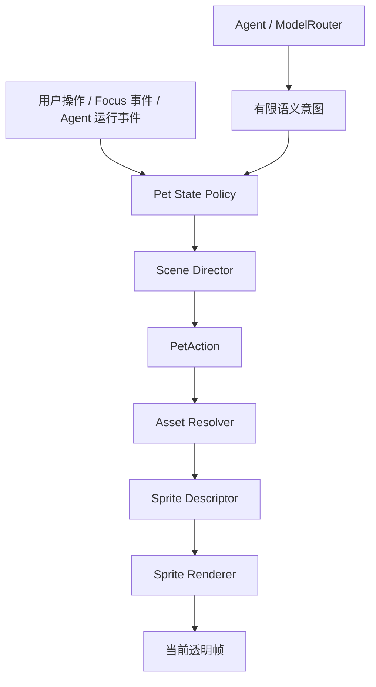

# NativeMind 学习桌宠 Sprite Sheet 动作设计与 AI 制作提示词 V1

> 目标：参考 Codex Pets 的“状态驱动 + Sprite Sheet + 代码选帧”机制，为 NativeMind 制作一只原创、安静、适合番茄钟学习场景的桌宠。
>
> 示例主题：晴天书房风格。
>
> 视觉角色暂定名：**小芽团**。名称可替换，角色 DNA 和动画契约不要随名称变化。
>
> 重要边界：参考 Codex 的技术机制和状态设计，不复制 Codex、Seedy 或其他内置宠物的具体造型、服装、逐帧姿势与美术资产。

---

## 0. 结论先行

NativeMind 最适合采用以下结构：

```text
透明 Sprite Sheet / WebP
  -> Sprite Renderer 按固定网格切帧
  -> Pet State Policy 选择语义动画
  -> Scene Director 处理优先级、一次性动作和回退
  -> Agent 只表达 needs_input / ready 等语义意图
  -> reduced-motion 时显示该动画的静态安全帧
```

需要明确区分：

### 代码负责

- 当前任务、专注、Agent 和错误状态。
- 选择哪个语义动画。
- 播放哪些帧。
- 每帧持续时间。
- 是否循环、从哪一帧开始循环。
- 一次性动作结束后的 fallback。
- 多种状态的优先级。
- 宠物位置、缩放、拖拽和点击区域。
- 专注期间是否安静。
- reduced-motion。
- 气泡文案和显示时间。

### 美术资源负责

- 小芽团外观。
- 每一帧的姿势和表情。
- 芽叶、身体、脸和道具的运动。
- 色彩、轮廓、光向和材质。
- 动作关键帧和首尾姿势。

### Agent 负责

- 在业务确实需要模型判断时，给出有限的语义意图。
- 生成一句短、平静的陪伴文案。

Agent 不负责文件名、帧号、FPS、坐标、Sprite Sheet 路径、CSS 类名和播放优先级。

---

## 1. Codex Pets 当前可确认的机制

### 1.1 官方产品行为

依据官方 Pets 文档：

- 桌面宠物可以悬浮在其他应用窗口上方。
- 宠物根据任务状态切换表现。
- 官方状态包括：
  - `Running`
  - `Needs input`
  - `Ready`
  - `Blocked`
- 多任务时的官方优先级为：

```text
Needs input > Blocked > Ready > Running
```

- 可以使用内置宠物或自定义宠物。
- 自定义宠物上传为透明 PNG 或 WebP。
- 上传尺寸必须是 `1536 × 1872`。
- 文件不超过 `20 MiB`。
- 系统开启减少动画时，宠物显示静态帧。
- 桌面应用完整渲染实现没有完全开源，因此不能声称桌面宠物由某段公开 React、CSS 或 Rust 代码完整实现。

官方资料：

- [Codex / ChatGPT Pets](https://learn.chatgpt.com/docs/pets)
- [OpenAI Codex Pets 源码目录](https://github.com/openai/codex/tree/main/codex-rs/tui/src/pets)

### 1.2 当前 CLI 源码结构

本文核对的是 `openai/codex` 主分支在 2026-08-04 的源码状态，主分支提交：

```text
17df7545a34ac533eedf5b628f49f2f1ad60e44e
```

当前目录包含：

| 文件 | 职责 |
| --- | --- |
| `model.rs` | Pet Manifest、帧网格、动画轨道、帧校验和默认动画 |
| `frames.rs` | 将 Sprite Sheet 按行列切成单帧 PNG |
| `ambient.rs` | 状态到动画映射、当前帧计算、持续时间、fallback 和 reduced-motion |
| `catalog.rs` | 内置宠物目录和默认尺寸常量 |
| `asset_pack.rs` | 内置资源下载、缓存和尺寸校验 |
| `image_protocol.rs` | 终端图片协议选择和绘制 |
| `sixel.rs` | Sixel 相关处理 |
| `picker.rs` | 宠物选择器 |
| `preview.rs` | 选择器中的宠物预览 |
| `mod.rs` | 模块入口和外部调用边界 |

### 1.3 默认网格

```text
Sprite Sheet: 1536 × 1872
Columns:      8
Rows:         9
Cell:         192 × 208
Grid cells:   72
```

关键修正：`72` 是网格格子总数，不代表默认轨道使用了 72 个有效动作帧。

当前默认轨道使用：

```text
idle          6
running-right 8
running-left  8
waving        4
jumping       5
failed        8
waiting       6
running       6
review        6
----------------
合计         57 个有效格子
```

剩余 15 个格子可以保持完全透明。在 NativeMind 自定义 Manifest 中，也可以将这些格子用于额外动作，但这样就不再只是照搬默认配置。

### 1.4 默认行语义

| 行 | 索引范围 | Codex 默认动作 | 默认使用格数 |
| ---: | --- | --- | ---: |
| 0 | 0-7 | `idle` | 6 |
| 1 | 8-15 | `running-right` / `move_right` | 8 |
| 2 | 16-23 | `running-left` / `move_left` | 8 |
| 3 | 24-31 | `waving` / `wave` | 4 |
| 4 | 32-39 | `jumping` / `bounce` | 5 |
| 5 | 40-47 | `failed` / `sad` | 8 |
| 6 | 48-55 | `waiting` | 6 |
| 7 | 56-63 | `running` | 6 |
| 8 | 64-71 | `review` | 6 |

默认状态映射：

```text
Running     -> running
Needs input -> waiting
Ready       -> review
Blocked     -> failed
无状态      -> idle
```

### 1.5 默认播放并非“状态动作永远循环”

当前开源实现中：

- `idle` 六帧持续循环。
- 其他默认动作先将本行动画播放三遍。
- 三遍完成后进入附加的 `idle` 帧序列。
- 随后只循环 `idle` 尾段。

这比让 `failed`、`waiting` 或 `review` 无限重复更安静，也更适合 NativeMind。

默认大致时序：

| 动画 | 单遍主动作 | 主动作播放三遍 | 后续 |
| --- | ---: | ---: | --- |
| move right / left | 约 1.06s | 约 3.18s | idle 循环 |
| wave | 约 0.70s | 约 2.10s | idle 循环 |
| bounce | 约 0.84s | 约 2.52s | idle 循环 |
| failed | 约 1.22s | 约 3.66s | idle 循环 |
| waiting | 约 1.01s | 约 3.03s | idle 循环 |
| running | 约 0.82s | 约 2.46s | idle 循环 |
| review | 约 1.03s | 约 3.09s | idle 循环 |

NativeMind 不一定要逐毫秒照搬，但应保留这个产品原则：

> 状态变化先给一次可见但克制的反馈，随后回到安静基准姿势。

### 1.6 reduced-motion

当前 CLI 源码在动画关闭时：

- 使用当前动画的第一帧。
- 不调度下一帧刷新。

NativeMind 应进一步为每个动画显式指定 `reducedMotionFrame`，避免某些动画的第一帧恰好是过渡姿势。

---

## 2. NativeMind 应该模仿什么

### 应该模仿

- 固定网格和帧尺寸。
- 透明 Sprite Sheet。
- 状态到动画的有限映射。
- 每帧可配置时长。
- 一次性动作结束后的 fallback。
- reduced-motion 静态帧。
- 多状态优先级。
- 资源与业务状态分离。
- 自定义角色只改变外观，不改变业务行为。

### 不应该照搬

- Codex 内置角色造型。
- Seedy 的头套、服装、脸型和逐帧动作。
- CLI 终端图像协议。
- 编程任务文案。
- `failed` 的夸张错误表情。
- 角色在屏幕上高频奔跑。
- 把桌面 App 未开源部分当成已知事实。

NativeMind 的目标不是“一个开发任务通知图标”，而是：

```text
一个可以在 25-60 分钟学习期间安静待着，
在用户需要选择、任务完成或遇到问题时给出短反馈，
并能与书房、图书馆、晴天、雨天、雪天场景融合的小伙伴。
```

---

## 3. 小芽团角色 DNA：晴天书房版本

### 3.1 角色定位

```yaml
id: little-sprout-sunny-v01
display_name: 小芽团
role: 安静的学习桌面伙伴
temperament:
  - 平静
  - 好奇
  - 低打扰
  - 不评价用户
  - 不打鸡血
narrative:
  - 用户学习时在旁边一起看书
  - 需要用户选择时抬头等待
  - 完成后给一个很轻的开心反馈
  - 遇到错误时表示“这里卡住了”，不表示“你做错了”
```

### 3.2 固定外观

- 身体是圆润但略扁的小豆团，不是人形，也不穿 Codex 风格头套。
- 主体颜色为低饱和浅鼠尾草绿。
- 两只小黑眼睛，位置固定，眼距固定。
- 小面积柔和珊瑚粉腮红。
- 头顶两片小芽，左叶略小、右叶略高，方向固定。
- 身体下方有两个非常短的小脚或软团接触点。
- 学习动作可以拿一本迷你暖白笔记本和一支短铅笔。
- 不增加耳朵、尾巴、衣服、帽子、围巾和随机饰品。
- 不使用可读文字、Logo、勾号、叉号和感叹号表达状态。

### 3.3 晴天配色

建议色板：

```yaml
body_base: "#A9C98C"
body_light: "#C4DDA9"
body_shadow: "#7F9F72"
sprout_base: "#6F9C5C"
sprout_light: "#91B876"
eyes: "#2E3932"
blush: "#DFA096"
notebook: "#F3EBDD"
pencil: "#C6945D"
sun_highlight: "#F0CC75"
outline: "#536451"
```

约束：

- 颜色为低饱和暖绿，不使用荧光绿。
- 轮廓使用深绿灰，不使用纯黑粗描边。
- 左上方有非常轻的晴日暖光，右下方是柔和冷绿阴影。
- 高光只占身体很小面积，不能像塑料或果冻。
- 不把晴天背景、太阳、云和山画进透明宠物资源。

### 3.4 材质和线条

- 2D 柔和扁平插画。
- 有极轻的纸张或蜡笔颗粒，但边缘必须干净。
- 轮廓约等效 2-3px，不随帧忽粗忽细。
- 身体有轻微压缩和回弹，不能像硬球。
- 芽叶的滞后运动比身体慢半拍。
- 所有帧的光向、颜色和颗粒强度一致。

### 3.5 画布与锚点

每帧：

```text
Canvas: 192 × 208 px
Background: transparent alpha
Anchor X: 96 px
Ground baseline: y = 188 px
Recommended occupied box:
  x = 30..162
  y = 24..188
Safe transparent padding:
  left/right >= 20 px
  top >= 12 px
  bottom >= 12 px
```

固定规则：

- 所有原地动作的脚底中心保持在 `(96, 188)`。
- 走路动作也优先做“原地步态”，由代码改变宠物位置。
- 单帧不能触碰画布边缘。
- 芽叶最高点不能在不同动作中突然变高 20px。
- 笔记本出现时不能改变宠物身体整体缩放。
- 阴影推荐由 NativeMind CSS 单独绘制，不烘焙进 Sprite Sheet。

---

## 4. NativeMind 学习桌宠应该有哪些状态

状态应分为三层，不能把所有东西塞进一个巨大枚举。

### 4.1 Agent / 任务状态

| 状态 | 含义 | 推荐动画 |
| --- | --- | --- |
| `running` | Agent 正在拆分任务、检索或生成内容 | `study_running` |
| `needs_input` | 等待用户确认、选择或回答 | `needs_input` |
| `ready` | Agent 结果完成但用户尚未查看 | `ready` |
| `blocked` | 模型不可用、工具失败或流程无法继续 | `concerned` |
| `none` | 没有 Agent 活动 | 交给学习状态决定 |

### 4.2 学习状态

| 状态 | 含义 | 推荐动画 |
| --- | --- | --- |
| `idle` | 用户没有进行中的专注 | `idle_loop` |
| `focus_active` | 正在番茄钟专注 | `study_loop` 或 `sleep_loop` |
| `focus_paused` | 暂停或等待继续 | `look_up` |
| `focus_elapsed` | 时间到了、等待用户收尾 | `ready` |
| `focus_completed` | 用户确认完成 | `cheer`，随后 idle |
| `break_active` | 休息中 | `stretch` 或 `drink` |
| `inactive` | 长时间无互动 | `sleep_enter -> sleep_loop` |

### 4.3 用户互动状态

| 事件 | 推荐动作 |
| --- | --- |
| 点击清醒宠物 | `greet` |
| 点击睡眠宠物 | `wake -> greet` |
| 拖动宠物 | 静态 `carried` 帧或极轻摇摆 |
| 放下宠物 | `land_soft` |
| 打开陪伴面板 | `look_up` |
| 用户回复气泡 | `nod` |

### 4.4 MVP 必做动作

第一批只做以下动作：

```text
idle_loop
study_loop
needs_input
ready
concerned
greet
cheer
sleep_enter
sleep_loop
wake
```

### 4.5 第二批扩展动作

```text
move_left
move_right
look_at_girl
look_outside
drink
stretch
nod
carried
land_soft
rain_idle
snow_idle
```

晴天、雨天、雪天不应该各自复制一整套业务动作。推荐：

- 角色主体动作共用。
- 时间与天气主要由场景背景表现。
- 宠物只有少量天气专属 idle 变体。
- 晴天可以让芽叶更舒展；雨天更容易趴睡；雪天偶尔看向窗外。

---

## 5. 状态优先级

NativeMind 推荐优先级：

```text
100 用户直接点击或拖动
 90 needs_input
 80 blocked
 70 ready / focus_elapsed
 65 focus_completed 一次性 cheer
 50 agent_running
 45 focus_active
 30 break_active
 20 auto_sleep
 10 ambient idle variation
  0 idle
```

其中 Agent 四状态内部继续遵守 Codex 的思想：

```text
needs_input > blocked > ready > running
```

行为规则：

- 用户点击可以短暂打断睡眠并播放 `wake -> greet`。
- `needs_input` 不能被普通 idle 动作盖住。
- `blocked` 只播放一轮克制的 concerned，不无限哭泣。
- `ready` 播放一次轻反馈，然后回到 idle，同时用 UI 状态点保持“未读”。
- `running` 不代表宠物必须一直快速运动；学习软件中应表现为低频看书或整理笔记。
- `petQuietInFocus = true` 时，`focus_active` 优先选择 `sleep_loop` 或极静态陪读，而不是持续 writing。

---

## 6. 方案 A：Codex 上传兼容 Sprite Sheet

如果目标是生成一张也可以按 Codex 默认布局解释的透明 Sprite Sheet，使用以下行分配。

### 6.1 规格

```text
File: little-sprout-sunny-codex-compatible-v01.webp
Size: 1536 × 1872 px
Grid: 8 columns × 9 rows
Cell: 192 × 208 px
Alpha: transparent
Maximum file size: 20 MiB
```

### 6.2 行分配

| 行 | 格子 | 动作 | NativeMind 含义 |
| ---: | --- | --- | --- |
| 0 | C0-C5 | idle | 安静呼吸和慢眨眼 |
| 0 | C6-C7 | transparent | 保持透明，兼容默认布局 |
| 1 | C0-C7 | move_right | 原地向右步态 |
| 2 | C0-C7 | move_left | 原地向左步态 |
| 3 | C0-C3 | wave | 点击后的轻招呼 |
| 3 | C4-C7 | transparent | 保持透明 |
| 4 | C0-C4 | bounce | 完成后的轻开心 |
| 4 | C5-C7 | transparent | 保持透明 |
| 5 | C0-C7 | failed | 卡住后的 concerned |
| 6 | C0-C5 | waiting | 等待用户输入 |
| 6 | C6-C7 | transparent | 保持透明 |
| 7 | C0-C5 | running | 一起学习 / Agent 工作 |
| 7 | C6-C7 | transparent | 保持透明 |
| 8 | C0-C5 | review | 结果完成 / 等待查看 |
| 8 | C6-C7 | transparent | 保持透明 |

### 6.3 每行动作设计

#### Row 0：Idle，6 帧

```text
F0 中性站姿，眼睛睁开，身体最低点
F1 缓慢吸气，身体上升 1-2px，芽叶稍展开
F2 呼吸峰值，眼神稳定
F3 慢眨眼开始，眼睛半闭
F4 眼睛轻闭，身体开始回落
F5 回到中性站姿，芽叶轻微滞后归位
F6-F7 完全透明
```

要求：首尾轮廓近似，不能大幅浮动。

#### Row 1：Move Right，8 帧

```text
F0 身体轻微向右倾，右脚准备
F1 右脚抬起，芽叶向左滞后
F2 右脚向前，身体稍低
F3 右脚落下，身体回升
F4 左脚抬起
F5 左脚向前
F6 左脚落下
F7 回到接近 F0 的循环姿势
```

要求：在单格中原地走，不让身体横向跑出画布。真正位移由代码完成。

#### Row 2：Move Left，8 帧

不是简单机械镜像。保持芽叶大小关系、脸和笔记本方向一致，重新绘制朝左步态。

#### Row 3：Greet / Wave，4 帧

```text
F0 中性站姿
F1 一侧小手或芽叶抬起
F2 轻轻向外摆一次，眼睛弯起
F3 回到接近中性姿势
F4-F7 完全透明
```

不要做连续快速挥手，不出现文字气泡。

#### Row 4：Cheer / Bounce，5 帧

```text
F0 轻微下压蓄力
F1 身体回弹上升
F2 离地或拉伸峰值不超过 4px
F3 柔和落下
F4 开心但克制地稳定下来
F5-F7 完全透明
```

不要加入彩带、烟花、金币、勾号和强光。

#### Row 5：Concerned / Blocked，8 帧

```text
F0 正常状态
F1 注意到问题，眼睛轻微收窄
F2 身体降低 1-2px
F3 芽叶轻微下垂
F4 向旁边看一下，表示正在思考
F5 轻呼吸，不哭泣
F6 身体略回升
F7 保持安静的 concerned 中性姿势
```

不要使用红叉、警报、眼泪、尖叫、摔倒或指责性表情。

#### Row 6：Needs Input，6 帧

```text
F0 停下当前动作
F1 抬头看向用户
F2 身体轻微前倾
F3 一片芽叶像举手一样抬起
F4 保持注意姿势
F5 回到等待中的安静姿势
F6-F7 完全透明
```

不要把问号画进 Sprite Sheet。状态标记和气泡由代码叠加。

#### Row 7：Study Running，6 帧

```text
F0 打开迷你笔记本，铅笔接触纸面
F1 小幅向右书写
F2 小幅向左书写
F3 身体轻微呼吸，笔记本稳定
F4 慢眨眼，铅笔仍在纸面附近
F5 回到 F0，可形成循环
F6-F7 完全透明
```

不要生成可读文字，不要让书页、铅笔或手的数量变化。

#### Row 8：Ready / Review，6 帧

```text
F0 停止书写
F1 抬头
F2 合上或稍微放低笔记本
F3 芽叶舒展，眼睛柔和弯起
F4 保持很轻的开心
F5 回到可接 idle 的稳定姿势
F6-F7 完全透明
```

不要使用奖杯、奖牌、烟花和夸张胜利动作。

---

## 7. 方案 B：NativeMind 学习语义 Sprite Sheet（推荐）

如果资源只用于 NativeMind，不需要直接上传到 Codex，建议仍使用相同的 `1536 × 1872 / 8 × 9` 网格，但将 72 个格子全部用于学习动作。

### 7.1 推荐行分配

| 行 | 动作 | 帧数 | 类型 |
| ---: | --- | ---: | --- |
| 0 | `idle_loop` | 8 | 循环 |
| 1 | `study_loop` | 8 | 循环 |
| 2 | `needs_input` | 8 | 一次性后安静等待 |
| 3 | `ready` | 8 | 一次性后 idle |
| 4 | `concerned` | 8 | 一次性后 idle |
| 5 | `greet` 4 帧 + `cheer` 4 帧 | 8 | 两个一次性动作 |
| 6 | `sleep_enter` 4 帧 + `sleep_loop` 4 帧 | 8 | 进入 + 循环 |
| 7 | `wake` 4 帧 + `look_at_girl` 4 帧 | 8 | 两个一次性动作 |
| 8 | `move_right` 4 帧 + `move_left` 4 帧 | 8 | 可循环步态 |

这套布局更贴合当前 NativeMind 的 `PetAction`：

```text
idle
greet
cheer
concerned
sleep_enter
sleep_loop
wake
look_at_girl
```

需要新增或建立别名：

```text
study_loop
needs_input
ready
move_left
move_right
```

### 7.2 为什么推荐这套布局

- 当前 NativeMind 已有自动休息与唤醒链，睡眠比左右跑动更重要。
- 学习期间最常见的是 idle、study、sleep，不是持续走动。
- 72 个格子都可被明确利用。
- 一个 Sprite Sheet 就能覆盖 MVP 和现有语义动作。
- 仍然保留 Codex 式固定网格、状态映射和 fallback 机制。

### 7.3 NativeMind 动画索引示例

```json
{
  "schemaVersion": 1,
  "id": "little-sprout-sunny",
  "spritesheet": "little-sprout-sunny-v01.webp",
  "frame": {
    "width": 192,
    "height": 208,
    "columns": 8,
    "rows": 9
  },
  "animations": {
    "idle": {
      "frames": [0, 1, 2, 3, 4, 5, 6, 7],
      "fps": 2.5,
      "loop": true,
      "reducedMotionFrame": 0
    },
    "study_loop": {
      "frames": [8, 9, 10, 11, 12, 13, 14, 15],
      "fps": 4,
      "loop": true,
      "reducedMotionFrame": 8
    },
    "needs_input": {
      "frames": [16, 17, 18, 19, 20, 21, 22, 23],
      "fps": 5,
      "loop": false,
      "fallback": "idle",
      "reducedMotionFrame": 22
    },
    "ready": {
      "frames": [24, 25, 26, 27, 28, 29, 30, 31],
      "fps": 5,
      "loop": false,
      "fallback": "idle",
      "reducedMotionFrame": 29
    },
    "concerned": {
      "frames": [32, 33, 34, 35, 36, 37, 38, 39],
      "fps": 5,
      "loop": false,
      "fallback": "idle",
      "reducedMotionFrame": 36
    },
    "greet": {
      "frames": [40, 41, 42, 43],
      "fps": 6,
      "loop": false,
      "fallback": "idle",
      "reducedMotionFrame": 42
    },
    "cheer": {
      "frames": [44, 45, 46, 47],
      "fps": 6,
      "loop": false,
      "fallback": "idle",
      "reducedMotionFrame": 46
    },
    "sleep_enter": {
      "frames": [48, 49, 50, 51],
      "fps": 5,
      "loop": false,
      "fallback": "sleep_loop",
      "reducedMotionFrame": 51
    },
    "sleep_loop": {
      "frames": [52, 53, 54, 55],
      "fps": 1.5,
      "loop": true,
      "reducedMotionFrame": 52
    },
    "wake": {
      "frames": [56, 57, 58, 59],
      "fps": 5,
      "loop": false,
      "fallback": "idle",
      "reducedMotionFrame": 59
    },
    "look_at_girl": {
      "frames": [60, 61, 62, 63],
      "fps": 4,
      "loop": false,
      "fallback": "idle",
      "reducedMotionFrame": 62
    },
    "move_right": {
      "frames": [64, 65, 66, 67],
      "fps": 7,
      "loop": true,
      "reducedMotionFrame": 64
    },
    "move_left": {
      "frames": [68, 69, 70, 71],
      "fps": 7,
      "loop": true,
      "reducedMotionFrame": 68
    }
  }
}
```

说明：上面的 FPS 是 NativeMind 初始建议值，不是 Codex 官方默认值。正式接入后应按实际画面测试微调。

---

## 8. 可直接使用的角色设定提示词

先生成角色设定图，不要第一步就生成完整 Sprite Sheet。

```text
你是一名资深 2D 角色设计师和桌面宠物动画设计师。

请为 NativeMind 桌面端学习辅助软件设计一只原创学习桌宠“小芽团”。参考 Codex Pets 的状态驱动 Sprite Sheet 机制，但不要复制 Codex、Seedy 或任何现有宠物的造型、服装、脸型、动作帧和美术细节。

角色定位：安静、温和、低打扰的学习伙伴，适合成年人在 25-60 分钟番茄钟期间长期放在桌面场景里。它不是儿童游戏吉祥物，不负责夸张庆祝，不评价用户，不打鸡血。

固定造型：
- 圆润但略扁的小豆团身体，不是人形。
- 主体为低饱和浅鼠尾草绿色。
- 两只位置固定的小黑眼睛，眼距固定。
- 小面积柔和珊瑚粉腮红。
- 头顶两片小芽，左叶略小，右叶略高，数量、方向和轮廓固定。
- 两个非常短的小脚或软团接触点。
- 学习时可以拿一本迷你暖白笔记本和一支短木色铅笔。
- 不增加耳朵、尾巴、衣服、帽子、围巾和随机配件。

晴天视觉 DNA：
- 2D 柔和扁平插画，极轻纸张或蜡笔颗粒。
- 深绿灰细轮廓，不使用纯黑粗描边。
- 左上方非常轻的暖色晴日光，右下方柔和绿灰阴影。
- 哑光、柔软、有轻微体积，不是塑料、金属或高透明果冻。
- 配色为浅鼠尾草绿、暖纸白、低饱和珊瑚和少量麦黄色。

输出一张角色设定表，包含：
1. 正面中性站姿。
2. 左右三分之四视图。
3. 侧面和背面。
4. idle、一起学习、等待用户、完成、卡住、招呼、趴睡、醒来八个关键姿势。
5. 眼睛睁开、半闭、闭合和柔和弯眼四种眼型。
6. 芽叶、笔记本、铅笔和脚底接触点的局部细节。

所有视图必须保持身体宽高比、眼睛间距、芽叶数量和方向、色板、轮廓粗细、光源方向一致。使用透明背景或干净纯色背景。不要生成完整房间、桌面 UI、文字、Logo、水印、标注、对话气泡、奖杯、勾号、红叉、感叹号和随机道具。
```

---

## 9. 可直接使用的 Codex 兼容 Sprite Sheet 总提示词

直接让生成模型一次生成 72 格通常不稳定。下面提示词适合做构图草案，不应直接作为最终交付。

```text
基于已经审核通过的 NativeMind“小芽团”角色设定图，生成一张透明背景 Sprite Sheet 草案。

技术规格必须严格满足：
- 总画布 1536 × 1872 px。
- 8 列 × 9 行规则网格。
- 每格 192 × 208 px。
- 行优先索引，从左到右、从上到下。
- 完整透明 alpha 背景。
- 每格角色脚底中心固定在 x=96、y=188 附近。
- 所有帧角色缩放、色板、线宽、光向和芽叶形状一致。
- 角色不触碰格子边缘，相邻格子内容绝不串格。

使用晴天书房风格：低饱和浅鼠尾草绿色身体、暖纸白笔记本、少量麦黄晴日高光、深绿灰细轮廓、轻微纸张颗粒、柔和扁平插画。不要生成场景背景和阴影底板。

九行动画：
Row 0：6 帧 idle 呼吸和慢眨眼，最后 2 格完全透明。
Row 1：8 帧原地向右步态。
Row 2：8 帧原地向左步态。
Row 3：4 帧轻招呼，最后 4 格完全透明。
Row 4：5 帧克制开心回弹，最后 3 格完全透明。
Row 5：8 帧遇到问题后的 concerned，不哭泣、不摔倒。
Row 6：6 帧抬头等待用户输入，最后 2 格完全透明。
Row 7：6 帧拿迷你笔记本一起学习，最后 2 格完全透明。
Row 8：6 帧完成后抬头柔和微笑，最后 2 格完全透明。

不要生成文字、问号、勾号、红叉、Logo、水印、背景、格线、编号、奖杯、彩带、金币、烟花、额外肢体、变化的服装、变化的芽叶数量、变化的笔记本颜色和不一致的透明边缘。
```

---

## 10. 推荐的生产方式：逐行动画提示词

正式生产不要依赖一次生成完整 Sprite Sheet。每一行单独制作，再由脚本打包。

### 10.1 通用前缀

以下前缀附加在每个动作提示词前：

```text
使用已经审核通过的 NativeMind“小芽团”标准角色参考图。

严格锁定：身体宽高比、眼睛位置和间距、腮红位置、两片芽叶的数量和方向、四肢数量、色板、轮廓粗细、光源方向、材质、笔记本和铅笔样式。

输出透明背景的独立连续姿势帧。每帧放在 192 × 208 px 透明画布中，脚底中心固定在 x=96、y=188，角色缩放和基线不变，相邻帧无镜头运动、无缩放、无旋转画布、无背景变化。
```

### 10.2 Idle Loop 提示词

```text
生成 8 帧安静 idle 循环。

动作只包含：身体上下 1-2px 的慢呼吸、非常轻的软体压缩、一次自然慢眨眼、芽叶比身体晚半拍的极小幅度摆动。首帧和末帧姿势接近，适合 2-3fps 长期循环。

不要挥手、跳跃、转身、移动脚底、张大嘴、出现道具和看向镜头外。
```

### 10.3 Study Loop 提示词

```text
生成 8 帧一起学习的无缝循环。

小芽团稳定拿着同一本暖白迷你笔记本，短铅笔始终在同一只小手中。动作包含非常小的左右书写、轻呼吸和一次慢眨眼。笔记本尺寸、页数、角度和颜色不变，铅笔数量和长度不变，手与纸张接触清晰。第 8 帧能自然回到第 1 帧。

不要生成可读文字、自动翻页、换手、额外手指、移动脚底、夸张点头和镜头运动。
```

### 10.4 Needs Input 提示词

```text
生成 8 帧一次性“等待用户选择”动作。

从 idle 开始，小芽团停下当前动作，抬头看向用户，身体轻微前倾，一片芽叶像举手一样抬起，保持短暂停顿，然后回到安静等待姿势。表情是注意和好奇，不是催促。

不要生成问号、文字、气泡、闪烁警报、连续挥手和夸张张嘴。最后一帧应适合作为 reduced-motion 静态等待姿势。
```

### 10.5 Ready 提示词

```text
生成 8 帧一次性“学习结果已准备好”动作。

小芽团从看笔记本的姿势停下，慢慢抬头，轻轻放低或合上笔记本，芽叶舒展，眼睛形成克制的柔和弯眼，随后回到能接 idle 的稳定姿势。反馈友好但不庆功。

不要生成奖杯、勾号、彩带、烟花、发光光环、跳出画布和大幅挥手。最后一帧必须能平滑回到 idle。
```

### 10.6 Concerned / Blocked 提示词

```text
生成 8 帧一次性“流程卡住了”动作。

小芽团注意到问题后，身体轻微降低，芽叶稍微下垂，眼睛收窄并向旁边思考，做一次很轻的呼吸，然后停在平静 concerned 姿势。表达“这里需要处理”，不表达“用户失败”。

不要生成哭泣、眼泪、红叉、警报、昏倒、发抖、愤怒、责备、破损道具和夸张黑暗阴影。最后一帧应可作为 reduced-motion 静态帧。
```

### 10.7 Greet 提示词

```text
生成 4 帧点击后的轻招呼动作。

从 idle 开始，小芽团抬起一只小手或一片芽叶，向用户轻轻摆一次，眼睛短暂弯起，然后回到接近 idle 的姿势。动作总时长约 0.7-1.0 秒。

不要连续挥手、跳跃、说话、生成气泡或改变角色位置。
```

### 10.8 Cheer 提示词

```text
生成 4 帧专注完成后的克制开心动作。

小芽团轻微下压蓄力，身体向上回弹不超过 4px，芽叶舒展，落地后露出柔和开心表情。动作轻、短、安静，适合番茄钟完成反馈。

不要彩带、烟花、金币、奖杯、强高光、旋转、翻跟头和大幅离地。
```

### 10.9 Sleep Enter 提示词

```text
生成 4 帧从 idle 进入趴睡的过渡动作。

小芽团缓慢降低身体，短脚收起，身体从圆润站姿变为横向稍扁的趴姿，眼睛逐渐闭合，芽叶随身体动作略微滞后。第 4 帧必须与 sleep-loop 第 1 帧完全兼容。

不要瞬间压扁、不要改变身体颜色和大小、不要生成枕头、被子、文字或 zzz。
```

### 10.10 Sleep Loop 提示词

```text
生成 4 帧趴睡无缝循环。

小芽团保持同一个趴姿，眼睛闭合，身体随呼吸上下不超过 1px，芽叶有更小的滞后摆动。首帧和末帧轮廓、位置、曝光和颜色完全连续，适合 1-2fps 长期播放。

不要翻身、睁眼、移动脚底、生成 zzz、气泡、枕头和镜头运动。
```

### 10.11 Wake 提示词

```text
生成 4 帧从趴睡醒来的过渡动作。

从与 sleep-loop 完全相同的趴姿开始，小芽团先睁开眼睛，身体缓慢回弹站起，芽叶小幅摆动，最后回到 idle 标准姿势。第 1 帧必须匹配 sleep-loop，第 4 帧必须匹配 idle。

不要瞬间弹起、不要改变身体比例、不要跳跃和生成文字。
```

### 10.12 Look at Girl 提示词

```text
生成 4 帧低频“看向正在学习的女孩”动作。

小芽团身体位置不变，只轻微转动眼神和上半部轮廓，芽叶向女孩方向小幅倾斜，停顿后回到中性。动作表达安静陪伴，不打断用户。

不要转身超过 20 度，不要移动脚底，不要挥手、跳跃和弹气泡。
```

---

## 11. 负面提示词

所有动作统一附加：

```text
no background,
no room,
no desk UI,
no text,
no letters,
no numbers,
no question mark,
no exclamation mark,
no logo,
no watermark,
no frame labels,
no grid lines in final export,
no trophy,
no confetti,
no coins,
no red cross,
no alarm icon,
no extra limbs,
no missing limbs,
no changing eye distance,
no changing sprout count,
no changing costume,
no changing notebook,
no inconsistent outline thickness,
no camera movement,
no zoom,
no perspective change,
no cropped body,
no touching cell borders,
no opaque background,
no white fringe,
no black fringe,
no glow halo,
no high-saturation neon green,
no plastic material,
no 3D photorealism,
no copied Codex pet silhouette
```

---

## 12. 不推荐直接让 AI 一次生成最终 Sprite Sheet

AI 一次生成完整九行通常会出现：

- 网格尺寸不准确。
- 角色在不同格中变大变小。
- 眼睛间距变化。
- 芽叶数量变化。
- 相邻格串色或串帧。
- 透明背景不干净。
- 手、铅笔和笔记本变形。
- 动作顺序不成立。
- 无法做到首尾循环。

推荐生产流程：

```text
1. 冻结角色设定图
2. 生成标准 idle 基准帧
3. 为每个动作画关键姿势
4. 用图生视频、首尾帧或插帧工具生成短动作
5. 人工选择需要的 4/6/8 帧
6. 每帧归一到 192 × 208 透明画布
7. 固定脚底锚点和颜色
8. 按索引打包为 1536 × 1872 Sprite Sheet
9. 生成动作 Manifest
10. 在实际 UI 中检查循环、缩放和点击区域
```

Sprite Sheet 应由脚本打包，不依赖生成模型精确绘制网格。

---

## 13. 晴天风格与其他天气的关系

晴天是角色基准色板，不意味着要在宠物资源里画太阳。

### 晴天

- 芽叶略舒展。
- 左上方暖色高光稍明显。
- idle 可以偶尔慢眨眼。
- ready 表情更明亮，但仍克制。

### 雨天

- 角色主体色板尽量不变。
- 场景光照层可以给宠物增加很弱的冷灰蓝环境色。
- 更容易触发 sleep_loop。
- 不建议重新制作所有业务动作。

### 雪天

- 场景层提供冷色漫反射。
- 宠物可以有低频 look_outside。
- 不把身体直接改成蓝色或白色。
- 不在 Sprite Sheet 中加入雪花，雪花由 WeatherRenderer 负责。

正确结构：

```text
同一套宠物 Sprite Sheet
+ 场景时间光照层
+ 天气环境层
+ 可选的少量 weather-specific idle 资产
```

错误结构：

```text
晴天 12 个动作一套
雨天 12 个动作重新生成一套
雪天 12 个动作再重新生成一套
```

后一种方式会造成角色身份、颜色和动作持续时间难以维护。

---

## 14. 与 NativeMind 当前代码的接入关系

当前项目已经有：

- `PetAction` 语义动作。
- `useActorQueue()` 动作队列。
- `resolveAnimation()` 资源解析。
- `AnimationDescriptor`。
- `PetActor` CSS fallback。
- `petAutoRest`。
- `petQuietInFocus`。
- `sleep_enter -> sleep_loop`。
- `wake -> greet`。
- companion store 与事件总线。

因此后续接入不应重写宠物业务，而是补充 Sprite Renderer。

### 14.1 推荐 Sprite Descriptor

```ts
interface SpriteAnimationDescriptor {
  renderer: 'sprite';
  src: string;
  frameWidth: number;
  frameHeight: number;
  columns: number;
  rows: number;
  frames: number[];
  fps?: number;
  frameDurationsMs?: number[];
  loop: boolean;
  loopStart?: number;
  fallback?: string;
  reducedMotionFrame: number;
}
```

### 14.2 渲染方式

Web 前端可以选择：

1. 使用 CSS `background-position` 和固定容器切换 Sprite Sheet 区域。
2. 使用 `<canvas>` 按源矩形绘制当前帧。
3. 首次加载后切成单帧 ImageBitmap 缓存。

对于当前 NativeMind：

- MVP 推荐 CSS background-position，依赖最少。
- 若需要精确 alpha、缩放和大量角色包，再考虑 Canvas。
- 不需要复刻 CLI 的 Kitty Graphics 或 Sixel 协议。

### 14.3 降级链

```text
Sprite Sheet 成功
  -> 按 Manifest 播放帧

Sprite Sheet 加载失败
  -> reducedMotionFrame / poster

poster 失败
  -> 当前 CSS PetActor

CSS 不可用
  -> 简单静态占位
```

---

## 15. Agent 与宠物状态的关系



### 15.1 Agent 可以输出

```json
{
  "kind": "pet_state_hint",
  "state": "needs_input",
  "speech": "这里需要你选一下。"
}
```

### 15.2 Agent 不可以输出

```json
{
  "file": "little-sprout.webp",
  "frames": [16, 17, 18],
  "fps": 12,
  "x": 820,
  "y": 610
}
```

第二种输出必须拒绝，因为它把模型与资源文件、渲染技术和布局耦合起来。

### 15.3 文案原则

宠物气泡：

- 不超过 30 个汉字。
- 一次一件事。
- 不使用感叹号。
- 不夸奖人格。
- 不指责。
- 不伪装心理治疗。
- 不在专注期间主动弹出。

示例：

```text
来了。今天想做点什么？
这里需要你选一下。
这段已经准备好了。
好像卡住了，先看看原因。
我在旁边待着。
累了就慢一点。
这一段结束了。
```

---

## 16. reduced-motion 与静态帧设计

不要简单地永远使用索引 0。每个状态选择最清晰的静态帧：

| 动画 | 推荐静态帧 |
| --- | --- |
| idle | 中性睁眼站姿 |
| study | 笔记本打开、铅笔稳定的姿势 |
| needs_input | 抬头、芽叶轻举的等待姿势 |
| ready | 柔和弯眼、笔记本放低的姿势 |
| concerned | 身体略低、芽叶稍垂但不哭泣 |
| greet | 芽叶或小手抬起的姿势 |
| cheer | 开心但已落地的姿势 |
| sleep | 眼睛闭合的稳定趴姿 |
| wake | 完成站立后的 idle 姿势 |

reduced-motion 下仍可：

- 切换静态状态帧。
- 显示气泡。
- 更新状态点。

reduced-motion 下不应：

- 自动循环呼吸。
- 自动眨眼。
- 跳跃。
- 连续走动。
- 通过快速闪烁提示状态。

---

## 17. 技术验收清单

### 文件

- [ ] 精确 `1536 × 1872`。
- [ ] 8 × 9 网格。
- [ ] 单格精确 `192 × 208`。
- [ ] PNG 或 WebP 含透明 alpha。
- [ ] 文件小于 20 MiB。
- [ ] 没有背景色和格线。
- [ ] 没有白边、黑边和半透明脏边。

### 一致性

- [ ] 72 个格子的身体宽高比一致。
- [ ] 眼睛间距一致。
- [ ] 芽叶数量、方向和颜色一致。
- [ ] 光源方向一致。
- [ ] 轮廓粗细一致。
- [ ] 笔记本和铅笔样式一致。
- [ ] 原地动作脚底锚点一致。

### 动画

- [ ] idle 首尾连续。
- [ ] study 首尾连续。
- [ ] sleep_enter 最后一帧匹配 sleep_loop。
- [ ] wake 第一帧匹配 sleep_loop，最后一帧匹配 idle。
- [ ] ready、concerned、greet、cheer 可以回到 idle。
- [ ] 所有一次性动作不会无限重复。
- [ ] reduced-motion 使用明确静态帧。

### 产品体验

- [ ] 专注中不会主动弹气泡。
- [ ] blocked 不责备用户。
- [ ] ready 不使用夸张庆祝。
- [ ] needs_input 足够可见但不持续挥手。
- [ ] 宠物不会遮挡 Focus HUD、Dock、女孩和主任务。
- [ ] 天气效果不烘焙进宠物帧。

---

## 18. 推荐制作顺序

```text
第一批：角色 DNA
  1. 正面、侧面、背面和三分之四视图
  2. 晴天标准色板
  3. idle、study、sleep 三个关键姿势

第二批：最小可用动画
  1. idle_loop
  2. study_loop
  3. needs_input
  4. ready
  5. concerned

第三批：互动动画
  1. greet
  2. cheer
  3. sleep_enter
  4. sleep_loop
  5. wake

第四批：Sprite Sheet
  1. 帧归一化
  2. 锚点校验
  3. 脚本打包
  4. Manifest
  5. reduced-motion 帧

第五批：NativeMind 接线
  1. Sprite Renderer
  2. Asset Resolver
  3. Scene Director
  4. Focus / Agent 事件映射
  5. CSS fallback

第六批：天气扩展
  1. 晴天基准
  2. 雨天 light integration
  3. 雪天 light integration
  4. 少量 weather-specific idle
```

制作时最优先保证的是角色一致性、锚点和状态可读性，不是帧数越多越好。对于 NativeMind，4-8 帧的克制动作通常比高帧率、持续表演的桌宠更适合长期学习。

